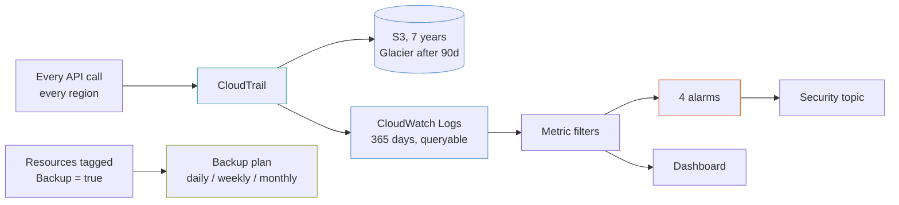

# account-baseline

What every AWS account should have before anything is deployed into it: a multi-region audit trail, four security alarms that mean something, a dashboard where every panel should read zero, and a backup plan that picks up resources by tag.

It is the least exciting example, and the one people most often skip.

## What it builds



- A customer-managed KMS key for the trail, logs, backups and security topic, with a 30-day deletion window.
- A multi-region CloudTrail trail with log file validation, global service events and CloudTrail Insights (API call rate and API error rate).
- An S3 bucket for the trail, moving log files to Glacier after 90 days and expiring them after seven years.
- A CloudWatch Logs copy of the trail with four metric filters, and the IAM role CloudTrail writes to it with.
- Four alarms publishing to an encrypted SNS security topic, and a CloudWatch dashboard with a panel per metric.
- An AWS Backup vault and plan that selects resources by tag, with job notifications sent to the security topic.

## Before you deploy

- AWS credentials for the target account, and Terraform 1.9 or later.
- **An organization trail needs the management account.** `is_organization_trail = true` is only valid there. See [Limits](#limits) for the bucket policy it also needs.
- **Decide on Vault Lock before you turn it on.** Read the warning under [Backups select by tag](#backups-select-by-tag).

## How to use it

Set any inputs you want to change in a `terraform.tfvars` (it is ignored by git), then:

```bash
terraform init
```

```bash
terraform plan
```

```bash
terraform apply
```

If you set `alert_email`, confirm the subscription from the email AWS sends, or no alarm reaches you.

To check the example without AWS credentials, run its plan test from the top of the repository. It plans against mock providers and creates nothing:

```bash
make test DIR=examples/account-baseline
```

The `.tf` files call modules by relative path (`../../modules/<name>`). If you copy this example outside this repository, change each `source` to `github.com/kingletas/terraform-aws-modules//modules/<name>?ref=v0.5.0`.

## Inputs worth knowing

| Variable | Default | Why you would change it |
|---|---|---|
| `region` | `us-east-1` | Where the trail, bucket and log group live. The trail records every region regardless |
| `trail_retention_years` | `7` | How long trail log files stay in S3 |
| `log_group_retention_days` | `365` | How long the queryable copy stays in CloudWatch Logs. This affects storage, not ingestion |
| `is_organization_trail` | `false` | Record every account in the organization. Management account only |
| `enable_vault_lock` | `false` | Make recovery points undeletable. Read the warning below first |
| `backup_selection_tag` | `Backup = true` | The tag that marks a resource for backup |
| `alert_email` | none | Subscribes an address to the security topic |

## The trail is written twice, and both copies matter

- **S3** is the durable copy, with log file validation on. Digest files make a tampered or deleted log detectable, which is the difference between a trail that is a convenience and one that is evidence. Seven years by default, in Glacier after 90 days.
- **CloudWatch Logs** is the queryable copy, kept 365 days by default. This is what the metric filters read and what a person searches during an incident.

## Four alarms, and each has a reason

A metric filter turns a log line into a number. These four are the ones worth being woken by:

| Alarm | Fires when | Why it matters |
|---|---|---|
| **Root account used** | at all | The root account should almost never be used. Any use is either a rare planned task or a serious problem |
| **Console sign-in without MFA** | at all | An IAM user with console access and no MFA is one password away from being someone else's |
| **Trail stopped, deleted or changed** | at all | Somebody turning off the thing that watches them. This is the alarm an attacker most wants you not to have |
| **Authorization failures** | above 20 in 5 minutes | Not at one. A handful of denials a day is ordinary; a sudden run of them is credentials being enumerated |

**Every metric filter sets `default_value = 0`.** Without it the filter publishes nothing when there are no matches, so the metric has gaps rather than zeroes, and an alarm over a gap depends entirely on `treat_missing_data`. That is a subtlety you do not want in the path of a security alert.

**There are no `ok_actions`.** "Root account use has stopped" is not information anybody needs. These alarms report an event; they are not a state to recover from.

## The CloudTrail grants go into the bucket module's policy

A bucket has exactly one policy, and the `s3-bucket` module owns it with a TLS-only statement. CloudTrail also needs `GetBucketAcl` on the bucket and `PutObject` under `AWSLogs/<account>/`, so this example writes those two statements and passes them in through `policy_documents`, where the module merges them into its own policy.

The ACL check is scoped by `aws:SourceArn` to this exact trail, and the write by `s3:x-amz-acl`. Without the `SourceArn` condition, any CloudTrail trail in any account could probe the bucket.

CloudTrail checks that it can write **when the trail is created**, so the trail must not be created before the bucket policy. The bucket module's `id` output waits for that policy, so passing `module.trail_bucket.id` to the trail orders them; no `depends_on` is needed.

## CloudWatch and AWS Backup can publish to the security topic

Two things must allow a service to publish. The topic policy must let it call `sns:Publish`, and the key encrypting the topic must let it encrypt the message.

- **The topic.** `publishing_services = ["cloudwatch.amazonaws.com", "backup.amazonaws.com"]` grants both, limited to requests from this account. Without the AWS Backup grant, backup job notifications are dropped.
- **The key.** `delivery_service_principals = ["cloudwatch.amazonaws.com"]` lets CloudWatch encrypt. `backup.amazonaws.com` is already in `service_principals`, because the backup vault uses the same key.

## Backups select by tag

```hcl
selection_tags = {
  marked = { key = "Backup", value = "true" }
}
```

Naming resource ARNs means every new database is unprotected until somebody remembers to add it. A tag condition picks up anything tagged from the moment it exists, and "we forgot to add the new one" is what backup gaps are usually made of.

Three tiers, all at 05:00 UTC:

| Rule | Runs | Cold storage after | Kept for |
|---|---|---|---|
| `daily` | every day | never | 35 days |
| `weekly` | Sundays | 30 days | 365 days |
| `monthly` | the 1st | 90 days | 2,555 days (about seven years) |

> [!WARNING]
> **Vault Lock is permanent**
>
> `enable_vault_lock = true` puts the vault in **compliance mode**, with a minimum retention of 7 days and a maximum of 2,555. After the 3-day `changeable_for_days` window, recovery points cannot be deleted early **by anyone, including the account root and AWS Support**, and the lock cannot be removed.
>
> That is right for a legal retention requirement and an expensive permanent mistake anywhere else: you cannot delete the data, and you cannot stop paying to store it. Read the AWS Backup Vault Lock documentation before setting it, and try it in a test account first.

## Multi-region is not optional

`is_multi_region_trail = true`. A single-region trail records nothing about the regions you are not watching, which is where unwanted activity tends to appear: credentials used to mine cryptocurrency in `ap-south-1` show up in no trail scoped to `us-east-1`.

Global service events (IAM, STS and CloudFront) are included, because those services are global and would otherwise be recorded nowhere.

## Costs

| What | Roughly |
|---|---|
| **CloudTrail management events, first copy** | free |
| **CloudWatch Logs ingestion** | `██████████` $0.50/GB, **usually the whole bill** |
| S3 storage after Glacier transition | `█░░░░░░░░░` a few dollars |
| CloudTrail Insights | `██░░░░░░░░` $0.35 per 100,000 events analysed |
| Backup storage | varies with what you tag |
| Alarms and dashboard | `█░░░░░░░░░` under $5 |

**A quiet account costs a few dollars a month. A busy one is dominated by log ingestion.** Ingestion is billed once, when the event arrives; `log_group_retention_days` only affects storage after that, so shortening it saves less than people expect. If ingestion is the problem, the answer is to send the trail to S3 only and query it with Athena, which loses the metric filters and these four alarms with them.

**Data events are not enabled.** They are billed per event, and object-level logging on a busy bucket generates a very large number of them.

## Limits

- **Organization trails need another bucket policy statement.** An organization trail writes under `AWSLogs/<organization-id>/`, and the bucket policy here only allows `AWSLogs/<account-id>/`. Add a grant for the organization prefix before setting `is_organization_trail = true`.
- **No GuardDuty, Security Hub or AWS Config.** Each is a worthwhile addition with its own per-account cost. This example is the trail and the alarms, not a security programme.
- **No IAM password policy.** The right values are an organizational decision.
- **No service control policies.** Those belong to the organization, not the account.
- **No restore test.** A backup plan that has never been restored from is a hypothesis. Test a restore of each resource type you tag.
