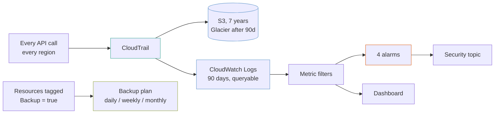

# Account baseline

The things every AWS account should have before anything is deployed into it: a multi-region audit trail, four security alarms that mean something, a dashboard where every panel reads zero, and a backup plan that picks up resources by tag.

This is the boring one, and it is the one people skip.

## The shape



## The trail is written twice, and both copies matter

- **S3** is the durable copy, with log file validation on. Digest files make a tampered or deleted log detectable, which is the difference between a trail that is a convenience and one that is evidence. Seven years, in Glacier after 90 days.
- **CloudWatch Logs** is the queryable copy, 90 days. This is what metric filters read and what a person greps at 2am.

**The CloudWatch copy is the expensive one** — ingestion is charged per gigabyte and a busy account produces a lot of trail.

**Retention is not the lever people reach for, though.** Ingestion is billed once, when the event arrives; retention only affects storage after that. Shortening retention saves storage and does nothing about the larger number. A year is kept here for that reason, and the lever for a genuinely expensive account is to send the trail to S3 only and query it with Athena — losing the metric filters, and these four alarms with them.

## Four alarms, and each has a reason

A metric filter turns a log line into a number. These four are the ones worth being woken by:

| Alarm | Fires when | Why it matters |
|---|---|---|
| **Root account used** | at all | The root account should be used approximately never. Any use is either a rare planned task or a serious problem |
| **Console sign-in without MFA** | at all | An IAM user with console access and no MFA is a password away from being someone else's |
| **Trail stopped, deleted or changed** | at all | Somebody turning off the thing that watches them. This is the alarm an attacker most wants you not to have |
| **Authorization failures** | above 20 in 5 minutes | Not at one. A handful of denials a day is ordinary; a sudden run of them is credentials being enumerated |

**Note `default_value = 0` on every metric filter.** Without it the filter publishes nothing when there are no matches, so the metric has gaps rather than zeroes — and an alarm over a gap depends entirely on `treat_missing_data`, which is a subtlety you do not want in the path of a security alert.

**Note also there are no `ok_actions`.** "Root account use has stopped" is not information anybody needs. These alarms notify an event; they are not a state to recover from.

## The bucket policy is written here, not in the module

The `s3-bucket` module writes a TLS-only policy and nothing else — it deliberately does not edit another module's policy. CloudTrail additionally needs `GetBucketAcl` on the bucket and `PutObject` under `AWSLogs/<account>/`, so the whole policy is composed and replaced in this example.

Both service statements are scoped: the ACL check by `aws:SourceArn` to this exact trail, and the write by `s3:x-amz-acl`. Without the `SourceArn` condition, any CloudTrail in any account could probe the bucket.

`depends_on = [aws_s3_bucket_policy.trail]` on the trail matters — CloudTrail validates it can write **at creation**, and without the ordering the apply fails on a race.

## Backups select by tag

```hcl
selection_tags = {
  marked = { key = "Backup", value = "true" }
}
```

Naming resource ARNs means every new database is unprotected until somebody remembers to add it. A tag condition picks up anything tagged from the moment it exists — the failure mode worth designing out, because "we forgot to add the new one" is what backup gaps are actually made of.

Three tiers: 35 days daily, a year weekly, seven years monthly with cold storage after 90 days.

> [!warning] Vault Lock is permanent
> `enable_vault_lock = true` puts the vault in **compliance mode**. Once `changeable_for_days` elapses, recovery points cannot be deleted or shortened **by anyone, including the account root, including AWS Support**.
>
> That is exactly right for a legal retention requirement and an expensive permanent mistake anywhere else — you cannot delete the data, and you cannot stop paying to store it. Read the AWS documentation before setting it, and set it in a test account first.

## Multi-region is not optional

`is_multi_region_trail = true`. A single-region trail records nothing about the regions you are not watching, which is precisely where unwanted activity appears — credentials mining in `ap-south-1` shows up in no trail scoped to `us-east-1`.

`include_global_service_events` covers IAM, STS and CloudFront, which are global and recorded nowhere else at all.

## What it costs

| What | Roughly |
|---|---|
| **CloudTrail management events, first copy** | free |
| **CloudWatch Logs ingestion** | `██████████` $0.50/GB — **usually the whole bill** |
| S3 storage after Glacier transition | `█░░░░░░░░░` a few dollars |
| CloudTrail Insights | `██░░░░░░░░` $0.35 per 100,000 events analysed |
| Backup storage | varies with what you tag |
| Alarms and dashboard | `█░░░░░░░░░` under $5 |

**A quiet account is a few dollars a month. A busy one is dominated by log ingestion** — that is the lever, and `log_group_retention_days` is not it (retention affects storage, not ingestion). If ingestion is the problem, the answer is to send the trail to S3 only and query with Athena, losing the metric filters and these four alarms with it.

**Data events are deliberately not enabled.** They are billed per event, and object-level logging on a busy bucket generates an astonishing number.

## What this does not do

- **No GuardDuty, Security Hub or Config.** Each is a real addition and each has its own per-account cost. This is the trail and the alarms, not a security programme.
- **No IAM password policy.** It is one resource and it belongs here; it is not written because the right values are an organizational decision.
- **No SCPs.** Those live in the organization, not the account.
- **No restore test.** A backup plan that has never been restored from is a hypothesis. Nothing here proves the recovery points are usable.

## What is not verified

**Nothing here has been applied against AWS.** The bucket policy and trail ordering is the part most likely to need a second look — CloudTrail's write check at creation is unforgiving.
