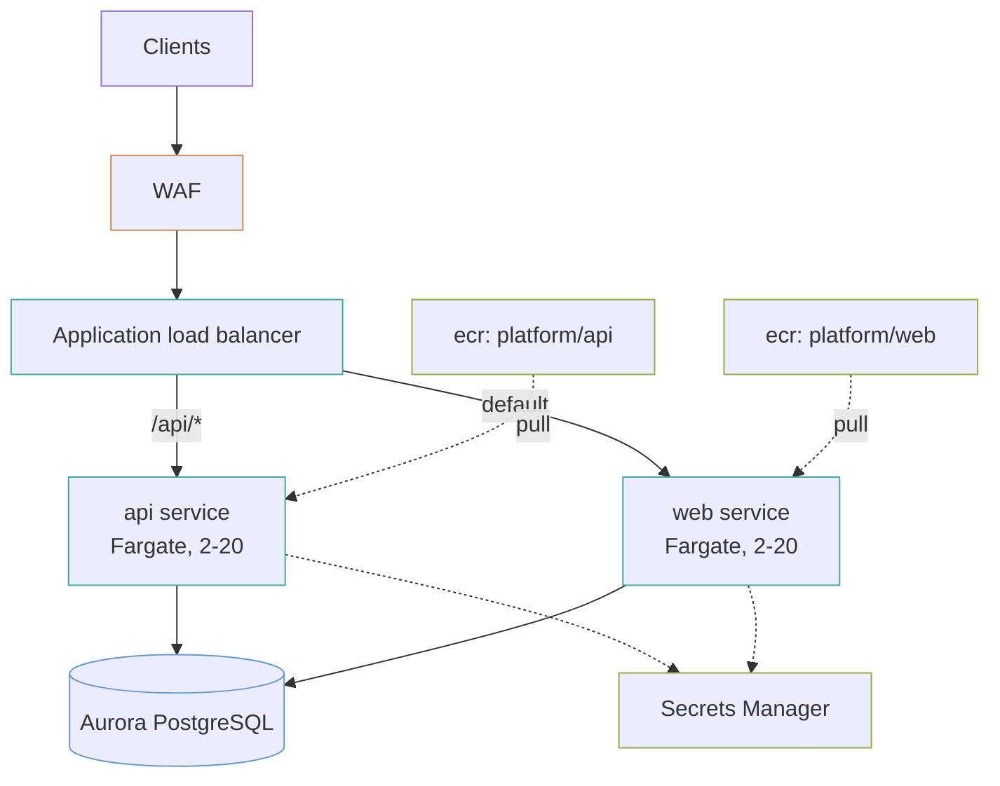

# Container platform

A multi-service platform on ECS Fargate: one ECR repository, task definition, service and target group per service, behind one load balancer, over one Aurora cluster.

Adding a service is one entry in `var.services`. Everything else follows.

## The shape



## Adding a service

```hcl
services = {
  api = {
    image_tag     = "v1.4.2"
    path_patterns = ["/api/*"]
    priority      = 100
  }

  worker = {
    image_tag      = "v1.4.2"
    container_port = 9000
    path_patterns  = ["/internal/*"]
    priority       = 200
    cpu            = 2048
    memory         = 4096
  }

  web = {
    image_tag = "v2.0.1"
  }
}

default_service = "web"
```

That produces a repository, a task definition, a service, a target group, autoscaling and a ceiling alarm for each one, and a listener rule for the two that asked for a path.

## Five things worth knowing

### Two IAM roles, not one

**`execution_role`** is what ECS itself uses, *before your code runs*, to pull the image and read the secrets named in the task definition. **`task_role`** is what the application assumes at runtime.

Collapsing them into one is the common shortcut, and it means a compromise of the application code also holds the ability to read every secret the platform starts with. Keeping them apart costs one extra module block.

A missing execution role is also the usual first failure, and it presents badly: the task never starts, and the reason is in the stopped-task detail rather than in any log.

### Tags are immutable, and that is a build change

`v1.4.2` names one image forever. A build cannot move it, so what is deployed always matches what that tag meant when it shipped.

This means **a build cannot overwrite `latest`**. Pipelines that push `latest` on every merge need changing — push an immutable build tag and deploy that. That is a real migration cost and it is the point of the setting.

### The image pull needs three VPC endpoints, not one

`ecr.api` for the registry API, `ecr.dkr` for the Docker protocol, and **the S3 gateway endpoint, because the layers themselves live in S3**.

Configure two of the three and pulls hang until they time out, with an error that names ECR and does not mention S3 at all. The S3 gateway endpoint is free, which makes leaving it out purely a mistake.

### The circuit breaker is what makes a bad deploy survivable

Without it, a rolling deployment of an image that cannot start will patiently replace every healthy task with one that crashes, and keep going. The service goes from fully healthy to fully down, on purpose, one task at a time.

`circuit_breaker` stops when the failures pile up, and `rollback_on_failure` puts the previous task definition back.

### Spot capacity with an on-demand floor

`base = 2` keeps two tasks on on-demand whatever happens to the spot market; everything above that is three-in-four spot. A spot reclamation event then costs capacity rather than the service.

Fargate Spot is roughly 70% cheaper and can be taken back with two minutes' notice. That trade is fine for stateless request handling and wrong for a job that cannot be interrupted.

## Deploying a new version

The image tag is a variable, so a deploy is a plan and an apply:

```bash
terraform apply -var='services={api={image_tag="v1.4.3",path_patterns=["/api/*"],priority=100},web={image_tag="v2.0.1"}}'
```

In practice that belongs in a `.tfvars` file the pipeline writes. **Terraform is a reasonable deploy mechanism for a small platform and a poor one for a busy pipeline** — every deploy is a state lock, and a rollback is a second apply. Past a certain deploy rate, have the pipeline update the service directly and leave Terraform owning the infrastructure around it.

## What it costs

Rough monthly order of magnitude in `us-east-1`, two services at two tasks each, before data transfer and discounts.

| Component | Roughly |
|---|---|
| Fargate, 4 tasks at 0.5 vCPU / 1 GB, mixed spot | `███░░░░░░░` $60 |
| Aurora Serverless v2, 2 instances at 0.5–8 ACU | `██████████` $180 |
| NAT gateways, one per zone | `█████░░░░░` $95 |
| Load balancer plus LCUs | `█░░░░░░░░░` $25 |
| ECR storage, 30 images per repository | `█░░░░░░░░░` $10 |

**`single_nat_gateway = true` on the VPC module cuts the NAT line to a third** and makes one zone a single point of failure for outbound traffic. On a platform whose egress already goes through VPC endpoints, that trade is often worth taking in non-production.

## What this does not do

- **No blue/green.** The rolling deployment with a circuit breaker is what is here. CodeDeploy blue/green needs a second target group per service and a deployment controller.
- **No service-to-service discovery.** Services reach each other through the load balancer. Service Connect or Cloud Map is the alternative and is not wired.
- **No queue-driven worker.** A worker with no load balancer needs `load_balancers = {}` and autoscaling on queue depth rather than CPU, which is a different scaling policy than this module exposes.
- **`enable_execute_command` is off.** Turning it on gives a shell inside a running production container; the cluster records every session, and it is still a shell in production.

## What is not verified

**Nothing here has been applied against AWS.** It validates and composes modules that validate. Whether the tasks start, and whether the health checks pass, is untested.
