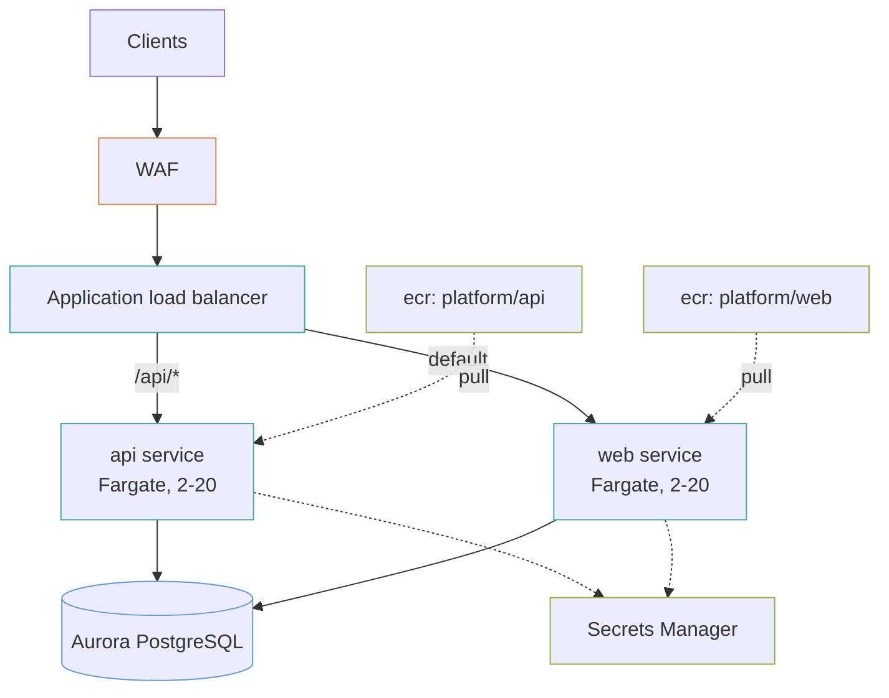

# container-platform

A multi-service platform on ECS Fargate: one ECR repository, task definition, service and target group per service, behind one load balancer, over one Aurora PostgreSQL cluster. Adding a service is one entry in `var.services`.

## What it builds



- A VPC across two zones with a NAT gateway per zone, flow logs, and endpoints for `ecr.api`, `ecr.dkr`, `logs`, `secretsmanager`, `ssmmessages` and S3.
- Per service: an ECR repository with immutable tags and scan on push, an ECS service with CPU target tracking between 2 and 20 tasks, one task on on-demand Fargate and most of the rest on Fargate Spot, and a load balancer target group.
- An application load balancer with an ACM certificate, HTTP redirected to HTTPS, and a regional WAF.
- An Aurora PostgreSQL 16.4 Serverless v2 cluster with a writer and a reader, 30 days of backups, and credentials in Secrets Manager.
- Separate ECS execution and task roles, a KMS key for data, logs and images, and a Route 53 alias record.
- An SNS alerts topic and alarms on the load balancer 5xx rate, database CPU, and each service running at its maximum task count.

## Before you deploy

- AWS credentials for the target account, and Terraform 1.9 or later.
- A public Route 53 hosted zone for the domain, in the same account. The certificate is validated through it.
- A build that can push images. The repositories are created by this apply, so the services cannot start until an image with the configured tag is pushed to each one. ECS keeps retrying until it appears.

## How to use it

`domain_name` and `hosted_zone_name` have no defaults:

```bash
terraform init
terraform plan -var domain_name=app.example.com -var hosted_zone_name=example.com
terraform apply -var domain_name=app.example.com -var hosted_zone_name=example.com
```

Then push each service's image to the URL in `terraform output repository_urls`, tagged with its `image_tag`.

To check the example without AWS credentials, run its plan test from the top of the repository. It plans against mock providers and creates nothing:

```bash
make test DIR=examples/container-platform
```

The `.tf` files call modules by relative path (`../../modules/<name>`). If you copy this example outside this repository, change each `source` to `github.com/kingletas/terraform-aws-modules//modules/<name>?ref=v0.3.0`.

### Add a service

```hcl
services = {
  api = {
    image_tag     = "v1.4.2"
    path_patterns = ["/api/*"]
    priority      = 100
  }

  worker = {
    image_tag      = "v1.4.2"
    container_port = 9000
    path_patterns  = ["/internal/*"]
    priority       = 200
    cpu            = 2048
    memory         = 4096
  }

  web = {
    image_tag = "v2.0.1"
  }
}

default_service = "web"
```

Each entry gets a repository, a task definition, a service, a target group, autoscaling and a ceiling alarm. Each service except `default_service` that sets `path_patterns` gets a listener rule; the default service takes everything else.

### Deploy a new version

The image tag is a variable, so a deploy is a plan and an apply:

```bash
terraform apply -var='services={api={image_tag="v1.4.3",path_patterns=["/api/*"],priority=100},web={image_tag="v2.0.1"}}'
```

In practice that belongs in a `.tfvars` file the pipeline writes. **Terraform is a reasonable deploy mechanism for a small platform and a poor one for a busy pipeline**: every deploy takes a state lock, and a rollback is a second apply. At a high deploy rate, have the pipeline update the service directly and leave Terraform owning the infrastructure around it.

## Inputs worth knowing

| Variable | Default | What it changes |
|---|---|---|
| `domain_name` | none | Domain the platform answers on |
| `hosted_zone_name` | none | Route 53 zone holding that domain |
| `services` | `api` on `/api/*`, `web` | Services, image tags, ports, paths, CPU and memory, scaling bounds, health path (`/healthz`) |
| `default_service` | `web` | Service receiving traffic that matches no path rule |
| `vpc_cidr` | `10.50.0.0/16` | VPC address range |
| `database_max_capacity` | `8` | Aurora Serverless v2 ceiling in ACUs |
| `max_tagged_images` | `30` | Tagged images kept per repository |
| `untagged_image_expiry_days` | `7` | Days before an untagged image expires |
| `alert_email` | `null` | Email subscribed to alarms; the subscription must be confirmed from the inbox |

## Two IAM roles, not one

**`execution_role`** is what ECS itself uses, *before your code runs*, to pull the image and read the secrets named in the task definition. **`task_role`** is what the application assumes at runtime.

Collapsing them into one is a common shortcut, and it means a compromise of the application code also holds the ability to read every secret the platform starts with. Keeping them apart costs one extra module block.

A missing execution role is also a common first failure, and it is hard to spot: the task never starts, and the reason is in the stopped-task detail rather than in any log.

## Tags are immutable, and that is a build change

`v1.4.2` names one image forever. A build cannot move it, so what is deployed always matches what that tag meant when it shipped.

This means **a build cannot overwrite `latest`**. A pipeline that pushes `latest` on every merge has to push an immutable build tag and deploy that instead.

## The image pull needs three VPC endpoints, not one

`ecr.api` for the registry API, `ecr.dkr` for the Docker protocol, and **the S3 gateway endpoint, because the image layers live in S3**.

Configure two of the three and pulls hang until they time out, with an error that names ECR and does not mention S3. The S3 gateway endpoint is free.

## The circuit breaker is what makes a bad deploy survivable

Without it, a rolling deployment of an image that cannot start replaces every healthy task with one that crashes, and keeps going until the service is fully down.

`circuit_breaker` stops the deployment when failures pile up, and `rollback_on_failure` puts the previous task definition back.

## Spot above an on-demand floor

Each service keeps one task on on-demand Fargate (`base = 1`) and places the rest three in four on Fargate Spot. Fargate Spot costs up to 70% less and can be reclaimed with two minutes' notice. The on-demand task keeps a service answering while its Spot tasks are replaced, which suits stateless request handling and not a job that cannot be interrupted.

The strategy is `local.capacity_provider_strategy` in `services.tf`. The services pass it through `capacity`, and the cluster uses it as its default. To run a service entirely on on-demand Fargate, pass `capacity = { launch_type = "FARGATE" }` instead.

## Costs

Rough monthly order of magnitude in `us-east-1`, two services at their minimum of two tasks each, before data transfer and discounts.

| Component | Roughly |
|---|---|
| Aurora Serverless v2, 2 instances at the 0.5 ACU floor | `██████████` $90, rising with load up to 8 ACU each |
| Fargate, 4 tasks at 0.5 vCPU / 1 GB, one per service on-demand and the rest mostly Spot | `█████░░░░░` $47 with two on Spot, $72 with none |
| Interface endpoints, 5 services × 2 zones | `████████░░` $73 |
| NAT gateways, one per zone | `███████░░░` $65 + data |
| Load balancer plus LCUs | `███░░░░░░░` $25 |
| WAF, one web ACL and four rules | `█░░░░░░░░░` $9 + $0.60 per million requests |
| ECR storage, up to 30 tagged images per repository | `█░░░░░░░░░` depends on image size, $0.10 per GB |

**`single_nat_gateway = true` on the VPC module halves the NAT line** and makes one zone a single point of failure for outbound traffic. On a platform whose AWS traffic already goes through VPC endpoints, that trade is often worth taking outside production.

## Limits

- **No blue/green.** Deployments are rolling with a circuit breaker. CodeDeploy blue/green needs a second target group per service and a different deployment controller.
- **No service-to-service discovery.** Services reach each other through the load balancer. Service Connect or Cloud Map is not wired.
- **No queue-driven worker.** Every service here is attached to the load balancer and scales on CPU. A worker with no load balancer that scales on queue depth needs a different service definition and scaling policy.
- **The WAF common rule set only counts.** `AWSManagedRulesCommonRuleSet` is in count mode, so it logs matches without blocking. The known-bad-inputs and IP reputation groups and the rate limit of 5,000 requests per five minutes per IP do block.
- **ECS Exec is off.** The task role and the `ssmmessages` endpoint allow it, but `enable_execute_command` is not set. Turning it on gives a shell inside a running production container.
