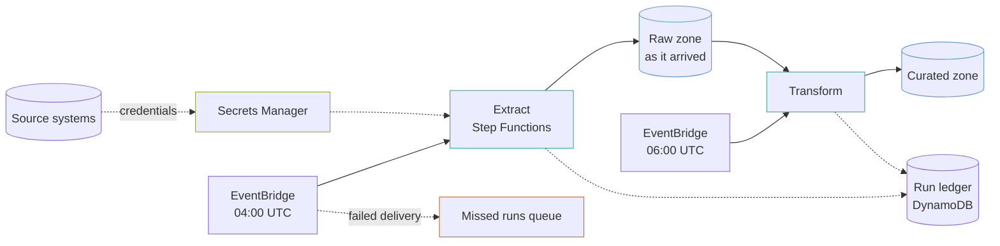

# data-pipeline

A nightly extract-and-transform pipeline: source systems into a raw zone, raw into curated, orchestrated by Step Functions on a schedule, with a run ledger and alarms that can tell "nothing to do" from "did not run".

It is the shape behind most warehouse loads. The services are ordinary; what matters is the four failure modes it is built to survive.

## What it builds



- A VPC across two availability zones with a single NAT gateway and flow logs.
- VPC interface endpoints for Secrets Manager, CloudWatch Logs, Step Functions and SQS, and gateway endpoints for S3 and DynamoDB.
- A customer-managed KMS key encrypting the buckets, secrets, ledger, state machine logs, queue and alert topic.
- A raw bucket and a curated bucket.
- An empty Secrets Manager secret per source.
- A DynamoDB run ledger keyed by source and run start time, with an index by status.
- Two STANDARD state machines, extract and transform, logging at `ALL` and traced with X-Ray, and the IAM role they run as.
- Two EventBridge schedules, each dead-lettering into a missed-runs SQS queue.
- An SNS alert topic and four alarms: extract failed, transform failed, extract did not run, and a schedule that could not deliver.
- A security group, `job_sg`, for the extraction and transform jobs you add.

## Before you deploy

- AWS credentials for the target account, and Terraform 1.9 or later.
- **A list of sources.** `sources` is empty by default, so the extract run has nothing to iterate over and no secrets are created until you add entries.
- **Network reach to the sources.** Jobs in the private subnets reach sources outside the VPC through the NAT gateway. Each source's firewall has to allow the NAT gateway's public address, or you add your own route to the sources.

## How to use it

Set your sources in a `terraform.tfvars` (it is ignored by git):

```hcl
sources = {
  erp = {
    engine      = "sqlserver"
    server_name = "erp.example.internal"
    port        = 1433
    database    = "erp"
    username    = "loader"
  }
}
```

Then:

```bash
terraform init
```

```bash
terraform plan
```

```bash
terraform apply
```

To check the example without AWS credentials, run its plan test from the top of the repository. It plans against mock providers and creates nothing:

```bash
make test DIR=examples/data-pipeline
```

The `.tf` files call modules by relative path (`../../modules/<name>`). If you copy this example outside this repository, change each `source` to `github.com/kingletas/terraform-aws-modules//modules/<name>?ref=v0.4.0`.

After the first apply, populate the secrets as described in [Secrets are created empty on purpose](#secrets-are-created-empty-on-purpose).

## Inputs worth knowing

| Variable | Default | Why you would change it |
|---|---|---|
| `sources` | `{}` | The systems to extract from, keyed by name. Each nightly run passes every source's name, `engine`, `server_name`, `port`, `database` and credentials secret ARN to the extract state machine as `$.sources`, for your extraction code. `username` is used in the secret commands |
| `extract_schedule` | `cron(0 4 * * ? *)` | When extraction starts, in UTC |
| `transform_schedule` | `cron(0 6 * * ? *)` | When the transform starts, in UTC. Leave room for extraction to finish |
| `raw_retention_days` | `90` | How long raw extracts are kept. Raw objects move to Standard-IA after 30 days, so keep this above 30 |
| `curated_retention_days` | `0` | Zero keeps curated data forever. Any other value also moves it to Standard-IA after 90 days, so keep it above 90 |
| `alert_email` | none | Subscribes an address to the alert topic. The subscription must be confirmed from the email |
| `vpc_cidr` | `10.60.0.0/16` | To avoid overlapping networks you route to |

## The four failures this is built around

### A pipeline that did not run looks exactly like one with nothing to do

Both produce no data and no errors. The difference is invisible in a dashboard, and it is the failure that goes unnoticed longest, usually until someone asks why a report is stale.

```hcl
metric_name         = "ExecutionsStarted"
comparison_operator = "LessThanThreshold"
threshold           = 1
period              = 3600
evaluation_periods  = 24
datapoints_to_alarm = 24
treat_missing_data  = "breaching"
```

**`treat_missing_data = "breaching"` is what makes this work.** No datapoint means no execution started, which is the condition being alarmed on. With the default `missing`, this alarm would sit in `INSUFFICIENT_DATA` forever and never fire. It fires once 24 consecutive hours pass with no execution started, which is the longest window CloudWatch allows (period times evaluation periods cannot exceed a day), so a run that slips into a later hour than the day before trips it.

### A schedule can fail to fire at all

EventBridge retries a failed delivery and then **drops it silently**. The `dead_letter_arn` on every target turns that into a message in the missed-runs queue, and an alarm fires on the first message.

The queue's policy lets EventBridge send to it only from this pipeline's two schedule rules. Without that policy the dead letter itself would be refused, and a night with no run would leave no record that a run was attempted.

### Unbounded parallelism takes down the source

```hcl
MaxConcurrency = 3
```

A `Map` state with no concurrency limit opens a connection to every source at once. When the sources are production databases, the pipeline built to read them becomes the reason they are slow, at 4am with nobody watching, and the symptom appears on the source system rather than on the pipeline.

Three at a time is a starting point, not a rule. What matters is that the number is stated.

### The raw zone is why a bad transform is not a disaster

Raw holds what arrived, unmodified, for 90 days by default. Fix a transform bug and reprocess; nothing has to be re-extracted, and nothing depends on a source system still holding the history.

Skipping the raw zone to save storage is a false economy the first time a transform is wrong for a week.

## Secrets are created empty on purpose

`module.source_credentials` makes a secret per source **with no value**, so no password is in Terraform state.

After the first apply:

```bash
terraform output -json populate_secrets_commands
```

That prints one `aws secretsmanager put-secret-value` command per source, with the username filled in. Replace the password placeholder and run each once. The pipeline reads the value at runtime, and rotating a password later never touches Terraform.

The secret module also offers `generate_password` and `initial_version`, and both put the secret in state in clear text, where anyone who can read the state can read it.

## STANDARD, not EXPRESS

A nightly load runs for an hour. An EXPRESS workflow is capped at five minutes, so it cannot do this job, and it keeps **no execution history**, which is what you want at 9am when somebody asks what happened.

STANDARD is billed per state transition, which for a nightly pipeline is pennies.

`include_execution_data` is off. Turning it on writes state input and output to CloudWatch Logs, which for a data pipeline means writing your data into logs.

The pipeline role carries the CloudWatch Logs delivery and X-Ray actions a state machine needs to log at `ALL` and trace. Those actions take no resource ARN, so they are granted on `*`.

## Single NAT gateway, on purpose

A batch pipeline runs for an hour a day and can be re-run. Paying for a NAT gateway in every zone around the clock to protect a job whose failure mode is "run it again" is the wrong trade. When the zone holding the NAT gateway fails, that night's load fails and the next night's succeeds.

State that when you choose it, because it is an availability decision and not only a saving.

## Costs

| What | Roughly |
|---|---|
| NAT gateway, one | `███░░░░░░░` $32 + data |
| VPC interface endpoints, 4 × 2 zones | `██████░░░░` $58 |
| S3 storage, raw plus curated | varies entirely with volume |
| Step Functions | `░░░░░░░░░░` pennies for a nightly run |
| DynamoDB on demand | `░░░░░░░░░░` pennies |

**The fixed network cost is most of the bill on a small pipeline.** The interface endpoints keep AWS API traffic off the NAT gateway, where the data processing charge would otherwise apply; the S3 and DynamoDB gateway endpoints do the same for data and cost nothing. On a pipeline moving little data, dropping the interface endpoints and keeping the gateway endpoints is the cheaper shape.

## Limits

The state machines show retry policy, concurrency limits and error handling, but their tasks are placeholder SDK calls that do no real work. What reads your sources and builds the curated data is yours to write:

- **No extraction code.** A Lambda function, a Glue job or an ECS task replaces the placeholder task.
- **No ledger writes.** The role may write to the run ledger, but nothing in the placeholder states does.
- **No Glue catalog or Athena.** Curated data sits in a bucket; making it queryable needs a catalog.
- **No schema handling.** A source column that changes type overnight breaks the transform, and nothing here detects it.
- **No backfill path.** Re-running for a date range means parameterising the execution input, which the schedule does not do.
- **No data quality checks.** A load that completes with 3 rows instead of 3 million triggers no alarm here.
