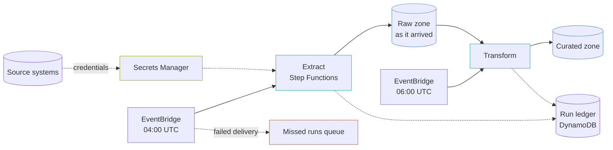

# Batch data pipeline

A nightly extract-and-transform pipeline: source systems into a raw zone, raw into curated, orchestrated by Step Functions on a schedule, with a run ledger and alarms that can tell "nothing to do" from "did not run".

This is the shape behind most warehouse loads. The interesting parts are not the services — they are the four failure modes it is built to survive.

## The shape



## The four failures this is built around

### A pipeline that did not run looks exactly like one with nothing to do

Both produce no data and no errors. The distinction is invisible in a dashboard and it is the failure that goes unnoticed longest — usually until someone asks why a report is stale.

```hcl
metric_name        = "ExecutionsStarted"
comparison_operator = "LessThanThreshold"
threshold          = 1
period             = 93600
treat_missing_data = "breaching"
```

**`treat_missing_data = "breaching"` is the whole trick.** No datapoint means no execution started, and that is the condition being alarmed on. With the default `missing`, this alarm would sit in `INSUFFICIENT_DATA` forever and never fire, which is worse than not having it.

### A schedule can fail to fire at all

EventBridge retries a failed delivery and then **drops it silently**. The `dead_letter_arn` on every target turns that into a message in a queue, with an alarm on it at a threshold of one.

Without it, a night with no run leaves no record anywhere that a run was ever attempted.

### Unbounded parallelism takes down the source

```hcl
MaxConcurrency = 3
```

A `Map` state with no concurrency limit opens a connection to every source at once. When the sources are production databases, the pipeline built to read them becomes the reason they are slow — at 4am, with nobody watching, and the symptom appears on the source system rather than on the pipeline.

Three at a time is a starting point, not a law. The point is that the number is stated.

### The raw zone is why a bad transform is not a disaster

Raw holds what arrived, unmodified, for 90 days. Fix a transform bug and reprocess; nothing has to be re-extracted, and nothing depends on a source system still holding the history.

Skipping the raw zone to save storage is a false economy the first time a transform is wrong for a week.

## Secrets are created empty on purpose

`module.source_credentials` makes a secret per source **with no value**. Nothing readable passes through Terraform state.

After the first apply:

```bash
terraform output -json populate_secrets_commands
```

That prints one command per source. Run each once. The pipeline reads the value at runtime, and rotating a password later never touches Terraform at all.

**This is the pattern to copy.** `generate_password` and `initial_value` both put the secret in state in clear text, where anyone who can read the state file can read it.

## STANDARD, not EXPRESS

A nightly load runs for an hour. EXPRESS caps at five minutes, so it cannot do this job at all — and it keeps **no execution history**, which is the artefact you actually want at 9am when somebody asks what happened.

STANDARD is billed per state transition, which for a nightly pipeline is pennies.

`include_execution_data` is off. Turning it on writes state input and output to CloudWatch, which for a data pipeline means writing your data into logs.

## Single NAT gateway, on purpose

Every other example here spreads NAT gateways across zones. This one does not.

A batch pipeline runs for an hour a day and can be re-run. Paying for a NAT gateway per zone around the clock to protect a job whose failure mode is "run it again" is the wrong trade. When the zone holding it fails, the night's load fails and tomorrow's succeeds.

Say that out loud when you choose it, because it is a real availability decision and not a saving.

## What it costs

| What | Roughly |
|---|---|
| NAT gateway, one | `███░░░░░░░` $32 + data |
| VPC interface endpoints, 4 × 2 zones | `██████░░░░` $58 |
| S3 storage, raw plus curated | varies entirely with volume |
| Step Functions | `░░░░░░░░░░` pennies for a nightly run |
| DynamoDB on demand | `░░░░░░░░░░` pennies |

**The fixed network cost is most of the bill on a small pipeline**, and the endpoints exist to keep S3 traffic off the NAT gateway, where the data charge would otherwise dominate. On a pipeline moving little data, dropping the interface endpoints and keeping the free S3 and DynamoDB gateway endpoints is the cheaper shape.

## What this does not do

The state machine definitions here are **structurally correct and functionally hollow** — they show retry policy, concurrency limits and error handling, and their tasks are placeholder SDK calls. What actually reads your sources is yours to write:

- **No extraction code.** A Lambda, a Glue job or an ECS task replaces the placeholder task.
- **No Glue catalogue or Athena.** Curated is Parquet in a bucket; making it queryable needs a catalogue.
- **No schema handling.** A source column that changes type overnight will break the transform, and nothing here detects it.
- **No backfill path.** Re-running for a date range means parameterising the execution input, which the schedule does not do.
- **No data quality checks.** A load that completes with 3 rows instead of 3 million alarms on nothing here. That is usually the second thing you need, after the pipeline runs at all.

## What is not verified

**Nothing here has been applied against AWS**, and the state machines do no real work. Treat this as the scaffolding and the failure handling, not as a working pipeline.
