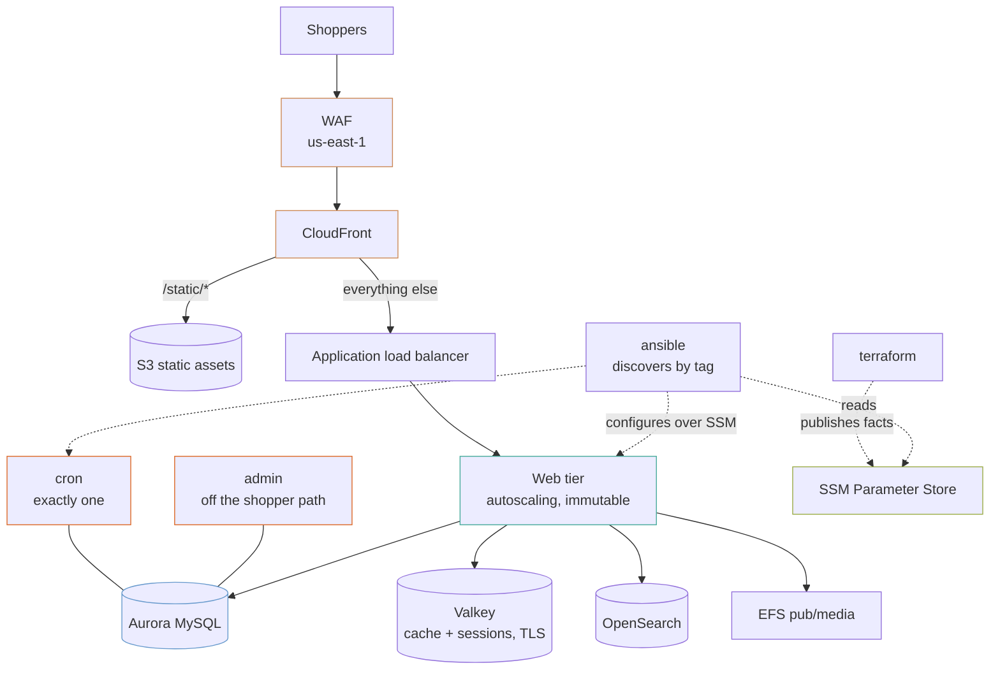

# magento

A complete Adobe Commerce (Magento) stack: CloudFront at the edge, an autoscaling web tier, the two nodes Magento cannot replicate, and Aurora, Valkey, OpenSearch and EFS behind them. Configuration is discovered by tag rather than written down, so it stays correct as the web tier scales.

## What it builds



- A VPC across two zones, with flow logs and endpoints for `ssm`, `ssmmessages`, `ec2messages`, `secretsmanager`, `logs` and S3.
- A web tier in an autoscaling group, scaling on CPU and released by instance refresh.
- A `cron` node and an `admin` node, plus an optional `builder` node.
- Aurora MySQL 8.0 Serverless v2, Valkey 8 with TLS and an auth token, OpenSearch 2.17, and EFS for `pub/media`.
- An application load balancer that accepts only CloudFront, a CloudFront distribution with a WAF in `us-east-1`, and certificates for the storefront and origin names.
- An Ansible dynamic inventory and group variables written to `ansible/`, and the stack's endpoints published to one SSM parameter.
- Alarms, a CloudWatch dashboard, an SNS alerts topic, and an AWS Backup plan for resources tagged `Backup = true`.

## Before you deploy

- AWS credentials for the target account, and Terraform 1.9 or later.
- For configuration: Ansible with the `amazon.aws` and `community.aws` collections, `curl` on the AMI, and the Session Manager plugin.
- **A public Route 53 hosted zone** for the storefront domain, in the same account. The example creates `<domain>` and `origin.<domain>` records and validates both certificates through it.
- **A base AMI.** It needs PHP and Magento's extensions, the SSM agent, the CloudWatch agent, `amazon-efs-utils` (the boot script mounts EFS with `mount -t efs -o tls`) and a web server answering `/health_check.php` on port 80. The default node user is `ubuntu`. The default instance types are Graviton (`c7g`) for staging, uat and production, so the AMI must be arm64 there; `dev` uses `t3.large`, which needs x86_64.
- **The account baseline.** EBS encryption defaults, the account public access block and the password policy belong in [`account-baseline`](../account-baseline), applied once per account.

## How to use it

```bash
cp terraform.tfvars.example terraform.tfvars
# set domain_name, hosted_zone_name and ami_id
terraform init
terraform plan
terraform apply
```

`terraform.tfvars` is gitignored.

To check the example without AWS credentials, run its plan test from the top of the repository. It plans against mock providers and creates nothing:

```bash
make test DIR=examples/magento
```

The tests plan both the staging defaults and production with the builder node.

The `.tf` files call modules by relative path (`../../modules/<name>`). If you copy this example outside this repository, change each `source` to `github.com/kingletas/terraform-aws-modules//modules/<name>?ref=v0.6.0`.

### Configure the nodes

Apply writes `ansible/aws_ec2.yml` (the dynamic inventory) and `ansible/group_vars/` into this directory. Both are gitignored. Run your own playbook against them:

```bash
ansible-playbook -i ansible/aws_ec2.yml site.yml
```

### Get a shell

SSH is closed everywhere. Session Manager reaches an instance in a private subnet with no public address, no open port and no key:

```bash
aws ssm start-session --target i-0123456789abcdef0
```

### Release a new version

A release is a new AMI:

```bash
terraform apply -var="ami_id=ami-0fedcba9876543210"
```

The web tier rolls through an instance refresh at 100% minimum healthy with a ten-minute warmup. **The `cron`, `admin` and `builder` nodes keep the AMI they were built from**, so a release never replaces the cron node while the web tier is half rolled or the database is half migrated.

When the web tier has finished and the database is migrated, roll the singletons onto the same AMI:

```bash
terraform apply -var="ami_id=ami-0fedcba9876543210" -replace=terraform_data.singleton_ami
```

Each singleton is stopped before its replacement starts, so cron does not run for a few minutes. Time it so the cron node is not replaced in the middle of a run.

Then invalidate what changed:

```bash
aws cloudfront create-invalidation --distribution-id "$(terraform output -raw cdn_distribution_id)" --paths '/' '/index.php'
```

Invalidate narrowly. Content-hashed asset names never need it.

## Inputs worth knowing

| Variable | Default | What it changes |
|---|---|---|
| `domain_name` | none | Storefront domain |
| `hosted_zone_name` | none | Route 53 zone holding that domain |
| `ami_id` | none | Base AMI for the web tier, and for the singletons when they are created or replaced |
| `environment` | `staging` | `dev`, `staging`, `uat` or `production`; decides sizing, retention and guards |
| `project` | `storefront` | Names every resource and is a discovery tag for Ansible |
| `instance_types` | `t3.large` dev, `c7g.large` staging and uat, `c7g.xlarge` production | Instance type per environment, used by the web tier and the singletons |
| `web_capacity` | environment default | Override `min`, `desired` or `max` for the web tier |
| `include_builder` | `false` | Add a `c7g.2xlarge` builder node with a 200 GiB workspace volume |
| `enable_waf` | `true` | Put the WAF in front of CloudFront |
| `alert_email` | `null` | Email subscribed to alarms; the subscription must be confirmed from the inbox |

## What is cattle and what is a pet

The web tier autoscales and is replaced by an instance refresh. Two jobs cannot be:

| | Why it cannot be replicated |
|---|---|
| **cron** | Two nodes running `bin/magento cron:run` claim the same `cron_schedule` rows. The symptoms are duplicate order confirmation emails, indexers stuck in `working`, and a consumer queue draining at half speed while both workers compete |
| **admin** | A capacity problem rather than a correctness one. A slow report or a mass attribute update should not take PHP workers away from checkout |

If the cron node dies, the site keeps serving and taking orders; indexing stops. That is the right failure mode, and it is why each singleton's `-down` alarm treats missing data as breaching: a stopped instance produces no metric, and silence must not read as health.

`include_builder` adds a third singleton and is **off by default**. Where CI builds the AMI there is nothing for a builder to do, and an idle `c7g.2xlarge` is an expensive way to do nothing.

## CloudFront, not a Varnish tier

Varnish in front of the web tier is the traditional Magento answer. On AWS, CloudFront is the better fit:

- CloudFront caches at the edge, not in one region.
- It needs no instances to patch, no purge broadcast to every node, and no tier that can itself fall over.
- Magento's own full page cache in Valkey covers what Varnish did behind the load balancer.

The `/static/*` behaviour goes straight to S3, so static content never touches PHP. `/media/*` is cached from the origin. What is lost is Varnish's VCL; edge logic that needs it goes in a CloudFront Function.

The static bucket is encrypted with SSE-S3 rather than the stack's KMS key: its objects are public through CloudFront anyway, and CloudFront's origin access control cannot read objects under a key that does not trust it. **Only the builder node can write the bucket.** Web, cron and admin nodes can read it and nothing more, so a compromised web node cannot plant a script every shopper downloads. Without `include_builder`, publish static assets from the pipeline that builds the AMI, with its own credentials.

## The load balancer answers only CloudFront

The load balancer has no port 80 listener, and its security group accepts HTTPS only from CloudFront's origin-facing managed prefix list. CloudFront adds an `X-Origin-Verify` header carrying a generated secret, and the only listener rule that forwards to the web tier requires it. Any other request, including one from another CloudFront distribution, gets a 403.

## Configuration is discovered, not written

**Half the stack is an autoscaling group.** Those instances do not exist when Terraform plans, and a host list written at apply time is wrong the first time the group scales. So the inventory is a rule, not a list:

```yaml
plugin: amazon.aws.aws_ec2
filters:
  tag:Project: [storefront]
  tag:Environment: [production]
keyed_groups:
  - key: tags.Role
```

A node joins its group (`web`, `cron`, `admin`, `builder`) by existing and carrying its `Role` tag. Ansible connects over Systems Manager, moving files through a dedicated S3 bucket, so this needs no key and no open port. The nodes have no permission on that bucket: the `community.aws.aws_ssm` connection plugin (community.aws 3.6.0 to 7.1.0, and `amazon.aws.aws_ssm` in amazon.aws 11.4.0, which community.aws redirects to) uploads and deletes with the credentials of the machine running Ansible and hands each node a presigned URL for `curl`, so that machine needs `s3:GetObject`, `s3:PutObject`, `s3:DeleteObject`, `s3:ListBucket` and `s3:GetBucketLocation` on it.

**Facts go to SSM Parameter Store, not to a file.** Every operator and every CI runner reads the same values. `terraform output ansible_facts_parameter` names the parameter. The same endpoints are written to `/etc/magento/environment` on each node at boot.

**Nothing secret is in the facts.** They carry the *ARN* of the database secret and the *names* of two SSM SecureString parameters holding the Valkey auth token and the OpenSearch master password. A node reads the values at runtime through its instance profile, which can read those three and nothing else. The same names are in `/etc/magento/environment` as `MAGENTO_DB_SECRET_ARN`, `MAGENTO_REDIS_AUTH_PARAMETER` and `MAGENTO_SEARCH_PASSWORD_PARAMETER`. `env.php` needs the Valkey token, with `scheme => tls`, for both the cache and the session handler.

## Environment separation is one variable

The `context` module holds one table of per-environment defaults, and nothing in this stack checks the environment beyond reading it. See [`context`](../../modules/context).

| | staging | production |
|---|---|---|
| Aurora | single writer, 0.5 to 8 ACU | writer and reader, 2 to 32 ACU |
| Cache | `cache.t4g.micro`, no replica | `cache.r7g.large` with a replica |
| Search | one `t3.small.search` node | two `r7g.large.search` nodes across zones |
| NAT gateways | one | one per zone |
| Web nodes | 1 to 4 | 2 to 12 |
| Backups | 7 days | 30 days, and `Backup = true` on every resource |
| Deletion protection | off | on |
| CloudFront price class | `PriceClass_100` | `PriceClass_200` |

`dev` and `uat` are single-AZ like staging. `dev` keeps 1-day backups and 1 to 2 web nodes; `uat` keeps 14-day backups, 2 to 4 web nodes and turns deletion protection on.

## Costs

Rough monthly figures at the default desired capacity, before traffic, data transfer and discounts.

| | staging | production |
|---|---|---|
| Web tier | 1 to 4 × `c7g.large` | 2 to 12 × `c7g.xlarge` |
| Singletons | 2 × `c7g.large` | 2 × `c7g.xlarge` |
| Aurora | 1 × 0.5 to 8 ACU | 2 × 2 to 32 ACU |
| Cache | `cache.t4g.micro` | `cache.r7g.large` × 2 |
| Search | 1 × `t3.small.search` | 2 × `r7g.large.search` |
| NAT | one | one per zone |
| WAF | $5 + six rules at $1 | $5 + six rules at $1 |
| **Roughly** | `███░░░░░░░` $450 | `██████████` $1,900 |

**The NAT gateways and the search tier are the two lines worth questioning.** Production runs a NAT gateway per zone for availability; the VPC endpoints keep S3 and Systems Manager traffic off them either way.

## Limits

- **No Ansible playbooks.** The inventory, group variables and facts are generated; `site.yml` is yours.
- **No AMI pipeline.** Nothing builds the image, and the image is the unit of deployment.
- **The Valkey token and OpenSearch password are also in Terraform state.** Terraform generates them, so the state holds them. Keep the state encrypted and access to it narrow.
- **No read/write splitting.** Both database endpoints are published; pointing Magento's read connection at the reader is an `env.php` change.
- **The WAF common rule set only counts.** `AWSManagedRulesCommonRuleSet` is in count mode because it has false positives against Magento's admin. The other managed groups and both rate limits (100 requests per five minutes per IP on `/admin`, 3,000 on everything) block.
- **No account baseline.** It belongs in [`account-baseline`](../account-baseline), not in an application stack, where two stacks would fight over the same settings.
