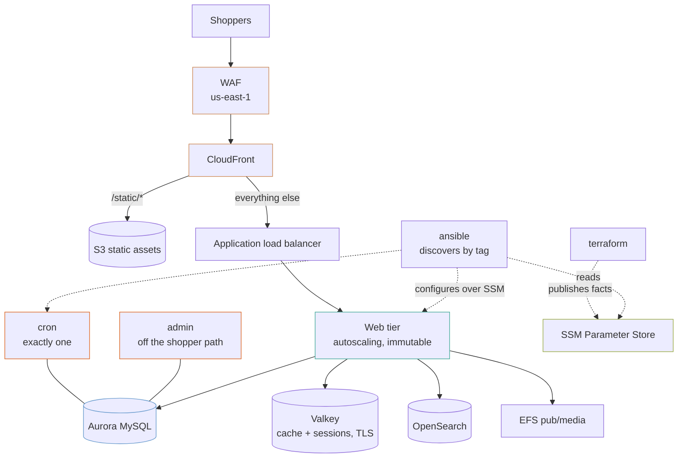

# Magento on AWS

A complete Adobe Commerce stack: CloudFront at the edge, an autoscaling web tier, the two nodes Magento genuinely cannot replicate, Aurora, Valkey, OpenSearch and EFS — with configuration discovered rather than written down.

One example rather than two, because the interesting question is not "pets or cattle" but **which parts of Magento are which**.

## The shape



## What is cattle and what is a pet

The web tier autoscales and is replaced by an instance refresh. Two things cannot be:

| | Why it cannot be replicated |
|---|---|
| **cron** | Two nodes running `bin/magento cron:run` claim the same `cron_schedule` rows. The symptoms are duplicate order confirmation emails, indexers stuck in `working` forever, and a consumer queue draining at half speed while both workers fight |
| **admin** | Not a correctness problem — a capacity one. A slow report or a mass attribute update should not take PHP workers away from checkout |

If the cron node dies, the site keeps serving and orders keep taking; you stop reindexing. That is the right failure mode and it is why the `cron-down` alarm treats missing data as breaching — a stopped singleton produces no metric, and silence must not read as health.

`include_builder` adds a third, and is **off by default**: where CI builds the AMI there is nothing for a builder to do, and an idle `c7g.2xlarge` is an expensive way to have nothing.

## CloudFront, not a Varnish tier

Varnish on a node in front of the web tier is the traditional Magento answer and it is not the best one on AWS:

- CloudFront caches at **the edge**, not in one region
- It needs no instances to patch, no purge broadcast to every node, no tier that can itself fall over
- Magento's own full page cache in Redis already does what Varnish was doing behind the load balancer

The `/static/*` behaviour goes straight to S3, so static content never touches PHP at all. What is lost is Varnish's VCL — if you have edge logic that genuinely needs it, a CloudFront Function is where it goes.

## There is no bastion

SSH is closed everywhere. The `ssm`, `ssmmessages` and `ec2messages` VPC endpoints let Session Manager reach an instance in a private subnet with no public address, no open port and no key to distribute:

```bash
aws ssm start-session --target i-0123456789abcdef0
```

A bastion is a host to patch, a key to rotate, and an address somebody eventually allow-lists too broadly. Systems Manager removes all three.

## Configuration is discovered, not written

This is the part that decides whether the stack stays correct.

**Half of it is an autoscaling group.** Those instances do not exist when Terraform plans, and any host list written at apply time is wrong the first time the group scales. So the inventory is a *rule*, not a list:

```yaml
plugin: amazon.aws.aws_ec2
filters:
  tag:Project: [storefront]
  tag:Environment: [production]
keyed_groups:
  - key: tags.Role
```

A node joins the `web` group by existing and carrying the tags — which the `context` module puts on everything. Ansible reaches it over Systems Manager, so this works with no key and no open port.

**Facts go to SSM Parameter Store, not to a file.** Every operator and every CI runner reads the same values, and a stale copy on somebody's laptop cannot exist:

```bash
ansible-playbook -i ansible/aws_ec2.yml site.yml
```

**Nothing secret is in the facts.** They carry the *ARN* of the database secret; the node reads the value at runtime through its instance profile.

## Environment separation is one variable

```bash
terraform apply -var="environment=staging"
```

Single-AZ Aurora with no reader, `cache.t4g.micro`, one search node, one NAT gateway, 7-day backups, no deletion protection, 1–4 web nodes, `PriceClass_100`.

```bash
terraform apply -var="environment=production"
```

Multi-AZ Aurora with a reader, `cache.r7g.large` with a replica, two search nodes across zones, a NAT gateway per zone, 30-day backups, deletion protection on, 2–12 web nodes, `PriceClass_200`, and `Backup = true` on every resource so the backup plan picks them up.

**There is no `if production` in this stack beyond reading those defaults.** They live in one table in [`context`](../../modules/context).

## Deploying

A release is a new AMI and an instance refresh:

```bash
terraform apply -var="ami_id=ami-0fedcba9876543210"
```

The autoscaling group rolls at 100% minimum healthy with a ten-minute warmup. The singletons are **not** rolled automatically — replacing the cron node mid-run is not something to do without looking, so it is a deliberate taint.

Then invalidate what changed:

```bash
aws cloudfront create-invalidation --distribution-id "$(terraform output -raw cdn_distribution_id)" --paths '/' '/index.php'
```

Invalidate narrowly. Content-hashed asset names never need it at all.

## What it costs

| | staging | production |
|---|---|---|
| Web tier | 1–4 × `c7g.large` | 2–12 × `c7g.xlarge` |
| Singletons | 2 | 2 |
| Aurora | 1 × 0.5–8 ACU | 2 × 2–32 ACU |
| Cache | `cache.t4g.micro` | `cache.r7g.large` × 2 |
| Search | 1 × `t3.small.search` | 2 × `r7g.large.search` |
| NAT | one | one per zone |
| WAF | $6 + rules | $6 + rules |
| **Roughly** | `███░░░░░░░` $450 | `██████████` $1,900 |

**The NAT gateways and the search tier are the two lines worth questioning.** Production runs one NAT per zone for availability; the VPC endpoints keep S3 and Systems Manager traffic off them either way.

## What this does not do

- **No Ansible playbooks.** The inventory and the facts are generated; `site.yml` is yours. What is proved here is that the seam is defined.
- **No AMI pipeline.** Nothing builds the image, and the image is the unit of deployment.
- **No origin verification enforcement.** CloudFront sends `X-Origin-Verify`; making the load balancer *require* it needs a listener rule that returns 403 without it. The secret is generated and the rule is not written.
- **No read/write splitting.** Both endpoints are published; pointing Magento's read connection at the reader is an `env.php` change.
- **No account baseline.** EBS encryption defaults, the account public access block and the password policy belong in [`account-baseline`](../account-baseline), applied once per account — not from an application stack, where two stacks would fight over the same settings.

## What is not verified

**Nothing here has been applied against AWS.** It validates, composes modules that validate, and passes checkov. The dynamic inventory has not been fed to a real Ansible run.
