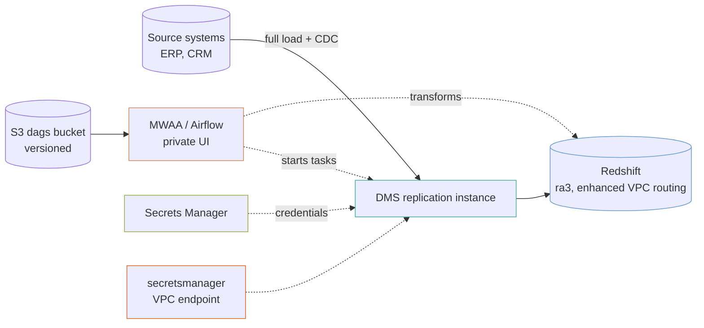

# MWAA data warehouse

Managed Airflow orchestrating DMS replication from source systems into Redshift, with every credential held in Secrets Manager and nothing readable passing through Terraform.

This is the shape of a warehouse load that has to keep up with a transactional system it does not own.

## The shape



## The one line that decides whether this works

```hcl
secrets_manager_endpoint_dns = module.endpoints.interface_dns_names["secretsmanager"][0].dns_name
```

A DMS endpoint configured with `secrets_manager_arn` reads its credentials **at connection time**, over the *public* Secrets Manager address. In a private subnet with no route to the internet, that request does not fail — **it hangs**, and the task sits in `testing` or fails a connection test with a timeout that says nothing about Secrets Manager.

The fix is `secretsManagerEndpointOverride` in the endpoint's extra connection attributes, pointing at the VPC interface endpoint. The `dms-replication` module builds that attribute from this variable.

This is the single most common reason a private DMS task never connects, and it is invisible from the console.

## Credentials never pass through Terraform

Every secret here is created **empty**. Nothing readable is in state.

After the first apply:

```bash
terraform output -json populate_secrets_commands
```

That prints one command per endpoint — the sources and the Redshift target. Run each once. DMS reads them at connection time, and rotating a password later never touches Terraform.

`generate_password` and `initial_value` both put the value in state in clear text. On a warehouse whose sources are production systems you do not own, that is not a trade worth making.

## Four things that will otherwise cost you an afternoon

### MWAA takes exactly two subnets

Not one, not three. The module validates it at plan time rather than letting AWS refuse twenty minutes into a create. The whole stack here is built across two zones for that reason.

### The Airflow security group must allow all traffic from itself

MWAA's scheduler, workers and web server reach each other through the group you give it. Without a self-referencing rule the environment fails to create — **about twenty minutes in**, with a message that does not mention security groups.

```hcl
peers = {
  description = "MWAA components reaching each other"
  ip_protocol = "-1"
  self        = true
}
```

### The DAG bucket must be versioned

MWAA refuses to create an environment otherwise. The `s3-bucket` module versions by default, so this one is free — but it is worth knowing when somebody points MWAA at a bucket that is not.

The same applies to `requirements.txt` and `plugins.zip`: **MWAA does not notice a changed file at the same key**. Pass `requirements_s3_object_version`, or a dependency change silently does nothing.

### The Celery queue ARN cannot be scoped to you

MWAA's executor runs on an SQS queue in **AWS's own account**, not yours. The IAM statement has to name `arn:aws:sqs:<region>:*:airflow-celery-*`, wildcard account included. That looks wrong in a review and is what AWS's own documentation specifies.

### Enhanced VPC routing is on

Without it, Redshift `COPY` and `UNLOAD` traffic leaves over the public network, where **neither your security groups nor your S3 gateway endpoint apply to it**. On means the traffic stays inside the VPC and is billed through the endpoint rather than the internet gateway.

## Airflow starts the tasks, DMS does not

`start_on_create = false` on every replication task. A task that begins the moment Terraform creates it will start a full load against a production source before anybody is watching — at whatever time the apply happened to run.

Airflow starts them, watches `DescribeTableStatistics`, and runs the transforms afterwards. That is the reason MWAA is here rather than a schedule on the task itself: **the ordering between "the load finished" and "the transform may run" is the actual problem**, and DMS has no opinion about it.

## What it costs

This is the expensive example. Rough monthly in `us-east-1`:

| Component | Roughly |
|---|---|
| **MWAA `mw1.small`**, 1 min worker, 2 schedulers | `██████████` **$350+** |
| **Redshift `ra3.large` × 2** | `██████████` $520 |
| DMS `dms.t3.medium`, single-AZ | `███░░░░░░░` $75 |
| NAT gateways, two zones | `███░░░░░░░` $65 + data |
| VPC interface endpoints, 5 × 2 zones | `████░░░░░░` $73 |

**About $1,100 a month before any data moves**, and MWAA is billed by the hour whether a DAG runs or not — there is no scale-to-zero. For a nightly batch load with no complex dependencies, [the `data-pipeline` example](../data-pipeline) does the same job with Step Functions for a fraction of that.

**MWAA earns its cost when the DAG graph is the hard part**: dozens of interdependent tasks, backfills, sensors waiting on external systems, and a team that already knows Airflow.

## What this does not do

- **No DAGs.** The bucket is created and empty. What actually starts the replication tasks and runs the transforms is yours to write.
- **No dbt or transformation layer.** Redshift holds raw replicated tables; modelling on top of them is not here.
- **No schema drift handling.** A source column that changes type will fail the task, and nothing here detects it in advance.
- **Single-AZ DMS.** `multi_az = false` by default. An instance failure mid-load means restarting the task, which for a full load can be hours.
- **`PRIVATE_ONLY` web server**, so reaching the Airflow UI needs a VPN or a bastion. That is deliberate — the alternative is an Airflow UI on the internet.
- **No Redshift Serverless.** The provisioned cluster here mirrors what the original ran. Serverless suits a warehouse that is idle most of the day.

## What is not verified

**Nothing here has been applied against AWS.** MWAA in particular takes 20 to 30 minutes to create and fails late when it fails, so the security group self-rule and the two-subnet requirement are the things to check before starting a create you will wait half an hour for.
