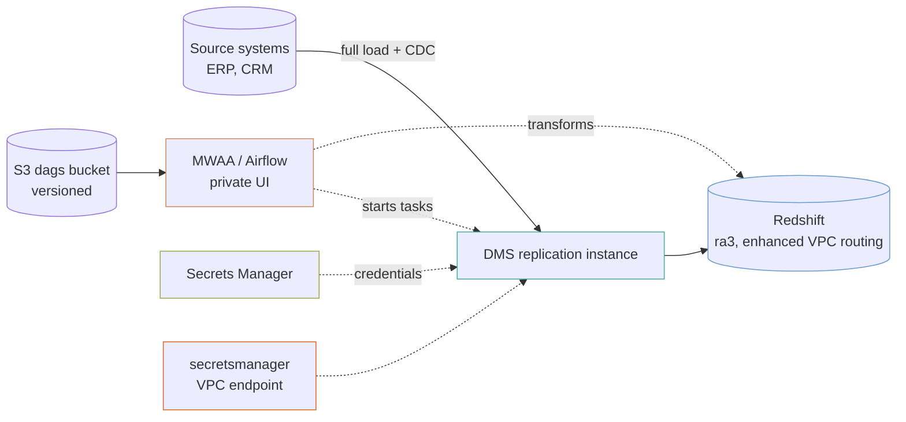

# mwaa-data-warehouse

Managed Airflow (MWAA) orchestrating DMS replication from source systems into Redshift, with every credential held in Secrets Manager and none of them passing through Terraform.

It is the shape of a warehouse load that has to keep up with a transactional system it does not own.

## What it builds



- A VPC across two availability zones, with a NAT gateway in each and flow logs.
- VPC interface endpoints for Secrets Manager, CloudWatch Logs, CloudWatch, SQS and KMS, and an S3 gateway endpoint.
- One customer-managed KMS key for the warehouse, replication, orchestration, secrets and alerts.
- Three buckets: the versioned DAG bucket, a staging bucket for `COPY` and `UNLOAD`, and an audit log bucket that expires logs after a year.
- A Redshift cluster (two `ra3.large` nodes by default) with enhanced VPC routing, audit logging and a master password Redshift manages in Secrets Manager.
- A DMS replication instance, one source endpoint and one replication task per entry in `sources`, and a Redshift target endpoint.
- An empty Secrets Manager secret per source and one for the Redshift target.
- An MWAA environment with a private web server, and the IAM role it runs as.
- An SNS alert topic and CloudWatch alarms for a stopped scheduler, queued tasks, Redshift disk above 85%, and change capture more than an hour behind on each source.

## Before you deploy

- **DMS account-level roles.** DMS needs `dms-vpc-role` and `dms-cloudwatch-logs-role` once per account, and the Redshift target needs `dms-access-for-endpoint`. The example creates all three. Set `create_dms_service_roles = false` where the first two exist, and `create_dms_endpoint_access_role = false` where `dms-access-for-endpoint` exists. The console creates it with any Redshift endpoint.
- **Network reach to the sources.** DMS connects out from the addresses in the `replication_instance_ips` output. Each source system's firewall has to allow them.
- **A way into the VPC** if you want the Airflow UI, which is private. A VPN or a bastion works; see the `client-vpn-cert-auth` example.
- **Time.** An MWAA environment takes 20 to 30 minutes to create and fails late when it fails. The two checks in [Four things that will otherwise cost you an afternoon](#four-things-that-will-otherwise-cost-you-an-afternoon) are the ones worth reading first.

## How to use it

Set your sources in a `terraform.tfvars` (it is ignored by git), then:

```bash
terraform init
```

```bash
terraform plan
```

```bash
terraform apply
```

To check the example without AWS credentials, run the plan test. It plans against mock providers and creates nothing:

```bash
terraform test
```

The `.tf` files call modules by relative path (`../../modules/<name>`). If you copy this example outside this repository, change each `source` to `github.com/kingletas/terraform-aws-modules//modules/<name>?ref=v0.3.0`.

After the first apply, populate the secrets as described in [Credentials never pass through Terraform](#credentials-never-pass-through-terraform), then sync your DAGs into the bucket under `dags/`.

## Inputs worth knowing

| Variable | Default | Why you would change it |
|---|---|---|
| `sources` | one SQL Server source, `erp` | The systems to replicate. Each entry takes a DMS `engine` name, an optional `database_name`, `table_mappings_json` (every table in every schema when unset) and `migration_type` (`full-load-and-cdc` by default) |
| `redshift_node_type`, `redshift_nodes` | `ra3.large`, `2` | Warehouse size |
| `dms_instance_class` | `dms.t3.medium` | Size it by change volume, not by source size |
| `airflow_environment_class` | `mw1.small` | `mw1.micro` runs one scheduler and one worker, and ignores `airflow_max_workers` |
| `airflow_max_workers` | `5` | Ceiling for worker autoscaling |
| `airflow_version` | `2.10.3` | Must be a version MWAA offers |
| `create_dms_service_roles`, `create_dms_endpoint_access_role` | `true` | Turn off where the account-level DMS roles exist |
| `alert_email` | none | Subscribes an address to the alert topic. The subscription must be confirmed from the email |
| `vpc_cidr` | `10.70.0.0/16` | To avoid overlapping networks you peer or route to |

## The one line that decides whether this works

```hcl
secrets_manager_endpoint_dns = module.endpoints.interface_dns_names["secretsmanager"][0].dns_name
```

A DMS endpoint configured with `secrets_manager_arn` reads its credentials **at connection time**, from the public Secrets Manager address. In a private subnet with no route to the internet, that request does not fail. **It hangs**, and the task sits in `testing` or fails a connection test with a timeout that says nothing about Secrets Manager.

The fix is `secretsManagerEndpointOverride` in the endpoint's extra connection attributes, pointing at the VPC interface endpoint. The `dms-replication` module builds that attribute from this variable, so DMS reaches Secrets Manager inside the VPC whether or not a NAT gateway is there.

This is the most common reason a private DMS task never connects, and the console gives no hint of it.

## Credentials never pass through Terraform

Every secret here is created **empty**, so no credential is in state.

After the first apply:

```bash
terraform output -json populate_secrets_commands
```

That prints one `aws secretsmanager put-secret-value` command per endpoint: each source and the Redshift target. Replace the placeholders and run each once. DMS reads the values at connection time, and rotating a password later never touches Terraform.

- **Source commands use port 1433**, the SQL Server port. Change it for any other engine.
- **The Redshift target command** fills in the username, host and port. Its password is the master password, which Redshift keeps in the secret named by the `warehouse_secret_arn` output.

The secret modules also offer `generate_password` and `initial_version`, and both put the value in state in clear text. On a warehouse whose sources are production systems you do not own, that is not a trade worth making.

## Four things that will otherwise cost you an afternoon

### MWAA takes exactly two subnets

Not one, not three. The `mwaa-environment` module checks this at plan time rather than letting AWS refuse twenty minutes into a create. The whole stack is built across two zones for that reason.

### The Airflow security group must allow all traffic from itself

MWAA's scheduler, workers and web server reach each other through the group you give it. Without a self-referencing rule the environment fails to create **about twenty minutes in**, with a message that does not mention security groups.

```hcl
peers = {
  description = "MWAA components reaching each other"
  ip_protocol = "-1"
  self        = true
}
```

### The DAG bucket must be versioned

MWAA refuses to create an environment otherwise. The `s3-bucket` module versions by default, and this example sets it explicitly. It matters when someone points MWAA at a bucket that is not versioned.

The same applies to `requirements.txt` and `plugins.zip`: **MWAA does not notice a changed file at the same key**. Pass `requirements_s3_object_version` to the module, or a dependency change silently does nothing.

### The Celery queue ARN cannot be scoped to your account

MWAA's executor runs on an SQS queue in **AWS's own account**, not yours. The IAM statement has to name `arn:aws:sqs:<region>:*:airflow-celery-*`, wildcard account included. That looks wrong in a review, and it is what AWS's own documentation specifies.

## Enhanced VPC routing is on

Without it, Redshift `COPY` and `UNLOAD` traffic does not pass through your VPC, so **neither your security groups nor your S3 gateway endpoint apply to it**. With it on, that traffic stays inside the VPC and goes through the S3 gateway endpoint.

## Airflow starts the tasks, not DMS

`start_on_create = false` on every replication task. A task that starts the moment Terraform creates it begins a full load against a production source before anybody is watching, at whatever time the apply ran.

Your DAGs start the tasks, watch `DescribeTableStatistics`, and run the transforms afterwards. The Airflow role is allowed to start, stop and describe replication tasks, query the warehouse through the Redshift Data API, and read the warehouse secret. That is why MWAA is here rather than a schedule on the task itself: **the ordering between "the load finished" and "the transform may run" is the actual problem**, and DMS has no opinion about it.

## Costs

This is the expensive example. Rough monthly figures in `us-east-1`:

| Component | Roughly |
|---|---|
| **MWAA `mw1.small`**, 1 min worker, 2 schedulers | `██████████` **$350+** |
| **Redshift `ra3.large` × 2** | `██████████` $520 |
| DMS `dms.t3.medium`, single-AZ | `███░░░░░░░` $75 |
| NAT gateways, two zones | `███░░░░░░░` $65 + data |
| VPC interface endpoints, 5 × 2 zones | `████░░░░░░` $73 |

**About $1,100 a month before any data moves.** MWAA is billed by the hour whether a DAG runs or not, and it cannot scale to zero. For a nightly batch load with no complex dependencies, [the `data-pipeline` example](../data-pipeline/README.md) does the same job with Step Functions for a fraction of that.

**MWAA earns its cost when the DAG graph is the hard part**: dozens of interdependent tasks, backfills, sensors waiting on external systems, and a team that already knows Airflow.

## Limits

- **No DAGs.** The bucket is created empty. What starts the replication tasks and runs the transforms is yours to write.
- **No transformation layer.** Redshift holds raw replicated tables; dbt or other modelling on top of them is not included.
- **No schema drift handling.** A source column that changes type fails the task, and nothing here detects it in advance.
- **Single-AZ DMS.** The replication instance uses the module's `multi_az = false`. An instance failure mid-load means restarting the task, which for a full load can take hours.
- **The Airflow UI is private.** The web server is `PRIVATE_ONLY`, so reaching it needs a VPN or a bastion. The alternative is an Airflow UI on the internet.
- **Provisioned Redshift only.** Redshift Serverless suits a warehouse that is idle most of the day, and it is not used here.
