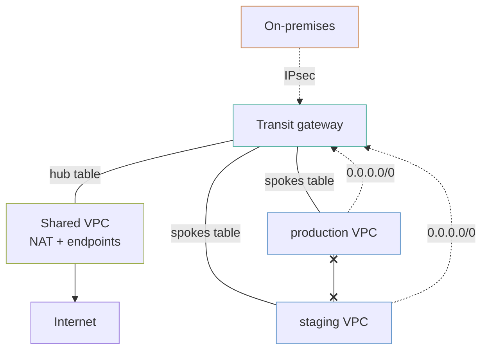

# network-hub

A shared services VPC with the NAT gateways and endpoints, spoke VPCs with neither, and a transit gateway routing between them so a spoke reaches shared services and the internet but not its siblings. Optionally, a site-to-site VPN to on-premises attached to the same gateway.

## What it builds



- A shared services VPC across two zones, with a NAT gateway per zone.
- One VPC per entry in `spokes` (`production` and `staging` by default), with no NAT gateway unless the spoke asks for one.
- A transit gateway with two route tables, `hub` and `spokes`, and the VPC routes that point at it.
- Seven interface endpoints and the S3 and DynamoDB gateway endpoints in the shared VPC, and a Route 53 private hosted zone per interface endpoint so every VPC resolves it by name.
- When `on_premises` is set: a site-to-site VPN attached to the transit gateway, logging to a CloudWatch log group kept for 365 days.

## Before you deploy

- AWS credentials for the target account, and Terraform 1.9 or later.
- An address plan. Every VPC CIDR must be unique and must not overlap on-premises ranges. See [CIDRs must not overlap](#cidrs-must-not-overlap).
- For the VPN: the public IP of the on-premises device, its BGP ASN if you use BGP, and the on-premises CIDRs.

## How to use it

```bash
terraform init
terraform plan
terraform apply
```

To add the VPN, set `on_premises` in a `.tfvars` file:

```hcl
on_premises = {
  gateway_ip = "203.0.113.10"
  bgp_asn    = 65010
  routes     = ["192.168.0.0/16"]
}
```

`routes` is required even with BGP. The VPC route tables are written from it, and routes learned by BGP are not known at plan time.

To check the example without AWS credentials, run its plan test from the top of the repository. It plans against mock providers and creates nothing:

```bash
make test DIR=examples/network-hub
```

The `.tf` files call modules by relative path (`../../modules/<name>`). If you copy this example outside this repository, change each `source` to `github.com/kingletas/terraform-aws-modules//modules/<name>?ref=v0.3.0`.

The `vpn_configuration` output holds the device configuration, including pre-shared keys. It is marked sensitive; read it with `terraform output -raw vpn_configuration` and hand it over out of band.

## Inputs worth knowing

| Variable | Default | What it changes |
|---|---|---|
| `shared_vpc_cidr` | `10.0.0.0/16` | Address range of the hub |
| `spokes` | `production` (`10.10.0.0/16`), `staging` (`10.20.0.0/16`) | Spoke VPCs; set `enable_nat_gateway = true` on one to give it its own egress |
| `availability_zones` | first two in the region | Zones every VPC spreads across |
| `on_premises` | `null` | Site-to-site VPN; `static_routes_only = true` skips BGP |
| `interface_endpoint_services` | `ssm`, `ssmmessages`, `ec2messages`, `secretsmanager`, `logs`, `ecr.api`, `ecr.dkr` | Interface endpoints in the hub |

## Association and propagation are the whole design

Getting these backwards produces a full mesh that looks like it works.

- **Association** decides which route table an attachment *looks up* routes in. One per attachment.
- **Propagation** decides which route tables *learn about* that attachment. Any number.

Here:

| Attachment | Associated with | Propagates to | Result |
|---|---|---|---|
| Shared | `hub` | `hub`, `spokes` | Every spoke learns how to reach shared services |
| Each spoke | `spokes` | `hub` | Shared learns the spoke; **no spoke learns another spoke** |
| VPN | `hub` | `hub`, `spokes` (by BGP or static route) | On-premises reaches the hub and every spoke |

Because a spoke's routes never propagate into the `spokes` table, production learns no route to staging. The `spokes` table does carry a `0.0.0.0/0` route to the shared attachment for internet egress, and that route would carry spoke-to-spoke traffic through the hub. So the table also holds a blackhole route for every spoke CIDR. The more specific blackhole wins, and the traffic is dropped at the gateway rather than filtered by a rule that could be relaxed.

**Both defaults are off** (`default_route_table_association`, `default_route_table_propagation`). Left on, every new attachment joins the default table and can reach everything, and nothing fails to tell you.

## Why the spokes have no NAT gateway

A NAT gateway is roughly $32 a month plus data, **per zone**. Three spokes across two zones would be six of them doing the same job.

Here the spokes route `0.0.0.0/0` to the transit gateway, the hub's NAT gateways do the work, and everything egresses from **one set of addresses**. That set is also the allow-list you hand a partner, from `nat_public_ips`.

The trade is real: transit gateway data processing is charged on top of NAT data processing, so traffic crossing the gateway is billed twice. At low egress volume the saved NAT gateways win. At high volume, per-spoke NAT is cheaper, which is what `enable_nat_gateway` on a spoke is for. A spoke with its own NAT gateway still gets explicit routes to the shared VPC and to on-premises through the transit gateway.

## Attachments do not create routes

A transit gateway attachment reports `available` and carries nothing until the **VPC** route tables point at it. This example writes those routes explicitly: shared private and public tables to each spoke, spoke private tables to `0.0.0.0/0` (or to the shared VPC, for a spoke with its own NAT gateway), and every private table to the on-premises ranges.

Three layers all have to agree:

1. The transit gateway route tables (association and propagation, above).
2. The VPC subnet route tables, pointing at the gateway.
3. Security groups on both ends, allowing the other's CIDR.

## Endpoints are centralised, and resolved by private hosted zones

Interface endpoints are billed hourly per availability zone. Seven services in three VPCs across two zones is 42 hourly charges; in the hub alone it is 14. The endpoint security group allows HTTPS from the shared VPC and every spoke.

With private DNS on, an endpoint's name resolves **only inside the hub VPC**, which defeats the sharing. So `private_dns_enabled = false`, and the example creates one Route 53 private hosted zone per service instead, named as the service's public hostname (`ssm.us-east-1.amazonaws.com`, `api.ecr.us-east-1.amazonaws.com`). Each zone holds an alias record at its apex and a wildcard, both pointing at the endpoint, and is associated with the hub and every spoke. A spoke calling Systems Manager by its usual name reaches the hub's endpoint across the transit gateway, with no code change.

A dotted short name is reversed to build the hostname: `ecr.api` becomes `api.ecr.<region>.amazonaws.com`. Check that holds for any service you add to `interface_endpoint_services`.

## CIDRs must not overlap

Two VPCs with overlapping ranges cannot be attached to the same transit gateway or peered, and cannot be connected later without renumbering a live network.

A `/16` for shared and a `/16` per spoke inside `10.0.0.0/8` leaves room for 255 spokes. Plan the whole space before the first apply, including ranges you do not need yet and the on-premises ranges you will route to.

## Costs

Approximate list prices per month.

| What | Roughly |
|---|---|
| Transit gateway attachments, 3 × $36 | `██████░░░░` $108 |
| Transit gateway data processing | `██░░░░░░░░` $0.02/GB |
| NAT gateways in the hub, 2 zones | `████░░░░░░` $65 + data |
| Interface endpoints, 7 × 2 zones | `██████░░░░` $100 |
| Private hosted zones for the endpoints, 7 × $0.50 | `░░░░░░░░░░` $3.50 + queries |
| Site-to-site VPN, plus its own attachment | `████░░░░░░` $72 + data |

**The attachments and the endpoints are the two lines to watch**, and both scale with how many things you connect rather than with traffic. A hub with two spokes and seven endpoints costs about $270 a month before a byte moves. The S3 and DynamoDB gateway endpoints are free.

## Limits

- **No Route 53 resolver rules.** The endpoint zones answer inside these VPCs only; on-premises clients do not resolve the endpoints by name.
- **No network firewall.** Spoke-to-spoke is blocked by routing. Inspecting traffic that *is* allowed needs AWS Network Firewall and an appliance-mode attachment.
- **Single account.** The `transit-gateway` module can share the gateway with other accounts through `share_with_principals`; this example does not.
- **No spoke-to-spoke exception.** Where two spokes must talk, add a third route table rather than relaxing these two.
