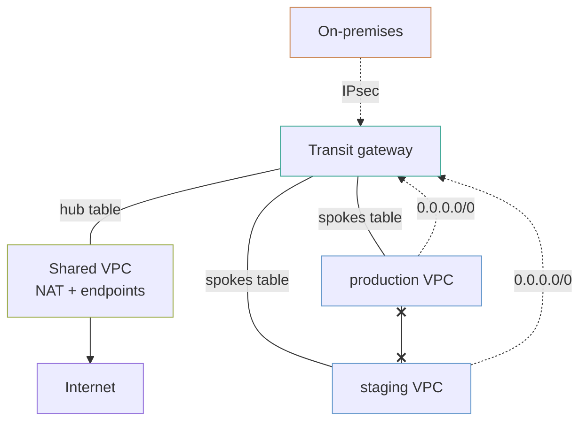

# Network hub and spokes

A shared services VPC with the NAT gateways and endpoints, spoke VPCs with neither, and a transit gateway routing between them so a spoke reaches shared services and the internet but not its siblings.

Optionally a site-to-site VPN to on-premises, attached to the same gateway.

## The shape

## Association and propagation are the whole design

This is the part that takes a second reading, and getting it backwards produces a full mesh that looks like it works.

- **Association** decides which route table an attachment *looks up* routes in. One per attachment.
- **Propagation** decides which route tables *learn about* that attachment. Any number.

Here:

| Attachment | Associated with | Propagates to | Result |
|---|---|---|---|
| Shared | `hub` | `hub`, `spokes` | Every spoke learns how to reach shared services |
| Each spoke | `spokes` | `hub` | Shared learns the spoke; **no spoke learns another spoke** |

Because a spoke's routes never propagate into the `spokes` table, production has no route to staging. Not a firewall rule that could be relaxed — no route at all.

**Both defaults are off** (`default_route_table_association`, `default_route_table_propagation`). Left on, every new attachment silently joins the default table and can reach everything, and nobody notices because nothing failed.

## Why the spokes have no NAT gateway

A NAT gateway is roughly $32 a month plus data, **per zone**. Three spokes across two zones is six of them, doing the same job.

Here the spokes route `0.0.0.0/0` to the transit gateway, the hub's NAT gateways do the work, and everything egresses from **one set of addresses** — which is also the allow-list you hand a partner, from `nat_public_ips`.

The trade is real: transit gateway data processing is charged on top of NAT data processing, so traffic crossing the gateway is billed twice. At low egress volume the saved NAT gateways win comfortably. At high volume, per-spoke NAT is cheaper, which is what `enable_nat_gateway` on a spoke is for.

## Attachments do not create routes

A transit gateway attachment reports `available` and carries nothing until the **VPC** route tables point at it. This example writes those routes explicitly, and it is the single most common reason a fresh transit gateway "does not work".

Three layers all have to agree:

1. The transit gateway route tables (association and propagation, above)
2. The VPC subnet route tables, pointing at the gateway
3. Security groups on both ends, allowing the other's CIDR

## Endpoints are centralised, and private DNS is off

Interface endpoints are billed hourly per availability zone. Seven services in three VPCs across two zones is 42 hourly charges; in the hub alone it is 14.

`private_dns_enabled = false` is deliberate and it is the catch. With private DNS on, the endpoint's name resolves **only inside the hub VPC**, which defeats the sharing. Making a centralised endpoint usable from a spoke needs a Route 53 private hosted zone per service, associated with every VPC — that is real work and it is **not done here**.

Until that exists, a spoke reaches these services through the hub's NAT gateways as normal. The endpoints save the hub's own traffic and are ready to be shared.

## CIDRs must not overlap, ever

Two VPCs with overlapping ranges cannot be attached to the same transit gateway, cannot be peered, and cannot be connected later by any means. It is the one decision in this file that cannot be undone without renumbering a live network.

`10.0.0.0/16` for shared and a `/16` per spoke leaves 256 spokes and room to grow. Plan the whole space before the first apply, including the ranges you do not need yet and the on-premises ranges you will have to route to.

## What it costs

| What | Roughly |
|---|---|
| Transit gateway attachments, 3 × $36/mo | `██████░░░░` $108 |
| Transit gateway data processing | `██░░░░░░░░` $0.02/GB |
| NAT gateways in the hub, 2 zones | `████░░░░░░` $65 + data |
| Interface endpoints, 7 × 2 zones | `██████░░░░` $100 |
| Site-to-site VPN | `██░░░░░░░░` $36 + data |

**The attachments and the endpoints are the two lines to watch**, and both scale with how many things you connect rather than with traffic. A hub with two spokes and seven endpoints costs about $270 a month before a byte moves.

## What this does not do

- **No Route 53 resolver rules**, so the centralised endpoints are not yet reachable by name from a spoke. Named above rather than left to be discovered.
- **No network firewall.** Spoke-to-spoke is blocked by having no route, which is strong. Inspecting traffic that *is* allowed needs AWS Network Firewall and an appliance-mode attachment.
- **No RAM sharing.** `share_with_principals` on the module attaches VPCs from other accounts; this example is single-account.
- **No spoke-to-spoke exception.** Where two spokes genuinely must talk, that is a third route table, not a relaxation of these two.

## What is not verified

**Nothing here has been applied against AWS.** Transit gateway routing in particular is one of those things where the configuration is plausible and the traffic still does not flow, so budget time for the first apply.
