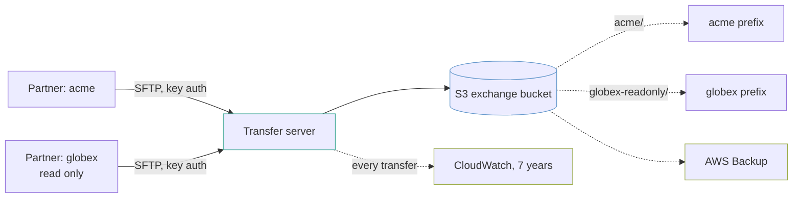

# Partner SFTP exchange

A managed SFTP server over one S3 bucket, where each partner sees only its own directory and every transfer is recorded.

This is the shape of integration nobody puts on a slide and everybody has: a partner sends a file every night, and it has to land somewhere your systems can read.

## The shape



## Each partner is confined to its own prefix

Every user gets its own IAM role, a policy allowing `ListBucket` **only** under `s3:prefix` matching its username, and a **logical** home directory mapped to `s3://bucket/username`.

Logical is the part that matters. With a physical home directory a partner can `cd ..` and see the bucket structure. With a logical one, `/` *is* their directory and there is nothing above it to navigate to.

The practical result: `acme` cannot list the bucket root, cannot read `globex-readonly/`, and cannot tell that `globex-readonly` exists.

## Public keys only, and no passwords

Service-managed identity has no password authentication at all. That is the correct answer for a partner integration, and it moves the operational burden to key handling — you need the partner's public key before you can onboard them, and rotating it is a Terraform change.

Adding a partner is one map entry:

```hcl
partners = {
  acme = {
    public_keys = ["ssh-ed25519 AAAAC3Nza... acme-integration"]
  }
}
```

Removing one removes their user, their role and their access. **It does not remove their files** — those stay in the bucket under their prefix until the lifecycle rule expires them, which is usually what you want when a contract ends.

## The security policy will break somebody

`TransferSecurityPolicy-2025-03` drops the older key exchange algorithms and ciphers. A partner on a decade-old client — and in file-exchange integrations there is usually one — will fail to connect, with an error on their side that reads as a network problem.

That is a deliberate trade and it is worth making knowingly rather than discovering during a go-live. The variable is there to move back a generation if you must, and moving back is a decision with a date on it, not a fix.

## Retention is two numbers, and they answer different questions

- **`retention_days`** is how long a delivered file stays. Partners re-send; auditors ask. A year is a common contractual answer.
- **The transfer log group is seven years**, because it is the record of *who moved what and when*. That question arrives long after the file itself stopped mattering, usually from someone in legal.

Versioning is on, so a partner overwriting yesterday's file with today's does not destroy yesterday's. AWS Backup runs on top of that, because a lifecycle rule with a bad prefix can remove versions and versioning cannot protect against its own configuration.

## The "no files" alarm needs a contract behind it

`notify_on_upload = true` alarms when nothing has arrived in 24 hours. That is genuinely useful where a partner is contracted to send a daily file, and pure noise where they send when they have something.

Turn it on per exchange, not by default — an alarm that fires every weekend because your partner does not work weekends is an alarm somebody will mute, and it takes the weekday failure with it.

## What it costs

| What | Roughly |
|---|---|
| **Transfer server, hourly** | `██████████` **$216/month** whether anyone connects or not |
| Data transferred | `█░░░░░░░░░` $0.04/GB each way |
| S3 storage | `█░░░░░░░░░` a few dollars |

**The server is billed by the hour from the moment it exists**, and that is the number that surprises people — roughly $2,600 a year for an endpoint that may see one file a night. For a single low-volume partner, a Lambda pulling from *their* SFTP server is often an order of magnitude cheaper. This shape earns its cost when several partners push to you and you want one door with one audit trail.

## What this does not do

- **No event on arrival.** A file lands and nothing happens. Wiring `aws_s3_bucket_notification` to a Lambda or a queue is the usual next step, and it is not here because what happens next is entirely yours.
- **No fixed IP addresses.** A `PUBLIC` endpoint's addresses can change. Partners whose firewall team wants an allow-list need `endpoint_type = "VPC"` with Elastic IPs, which the module supports and this example does not use.
- **No file validation.** Nothing checks that what arrived is what was promised.
- **No PGP.** Files are encrypted at rest by KMS and in flight by SSH. Partners who require content-level encryption need a decryption step after arrival.

## What is not verified

**Nothing here has been applied against AWS.** The per-user IAM policy in particular is the piece worth testing with a real key before onboarding a partner.
