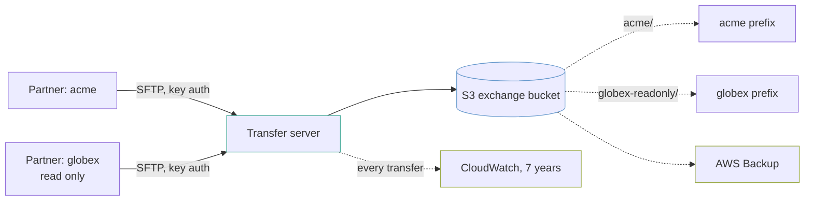

# partner-sftp-exchange

A managed SFTP server (AWS Transfer Family) over one S3 bucket, where each partner sees only its own directory and every transfer is recorded.

It is the integration nobody puts on a slide and almost everybody has: a partner sends a file every night, and it has to land somewhere your systems can read.

## What it builds



- A public SFTP-only Transfer server with service-managed users and the `TransferSecurityPolicy-2025-03` security policy.
- One user per partner, each with its own IAM role, SSH public keys and a logical home directory.
- A versioned S3 bucket encrypted with a customer-managed KMS key, with lifecycle rules for expiry and infrequent access.
- A transfer log group kept for seven years (2,557 days).
- An AWS Backup plan that backs up the bucket daily at 07:00 UTC and keeps each recovery point for 90 days.
- An SNS alert topic that CloudWatch alarms and AWS Backup job events publish to.
- A metric filter and alarm for authentication failures against partner usernames, and an optional alarm when no files arrive for a day.

## Before you deploy

- AWS credentials for the target account, and Terraform 1.9 or later.
- **Each partner's SSH public key.** Password authentication is not available, so you cannot create a partner without one.
- **A username per partner.** The username is also the partner's directory in the bucket, and the key in the `partners` map.

## How to use it

Copy the variables file and replace the example partners and keys with real ones:

```bash
cp terraform.tfvars.example terraform.tfvars
```

Then:

```bash
terraform init
```

```bash
terraform plan
```

```bash
terraform apply
```

Give each partner the `sftp_endpoint` output, their username, and the `host_key_fingerprint` output so they can check the server on first connect.

To check the example without AWS credentials, run its plan test from the top of the repository. It plans against mock providers and creates nothing:

```bash
make test DIR=examples/partner-sftp-exchange
```

The `.tf` files call modules by relative path (`../../modules/<name>`). If you copy this example outside this repository, change each `source` to `github.com/kingletas/terraform-aws-modules//modules/<name>?ref=v0.4.0`.

## Inputs worth knowing

| Variable | Default | Why you would change it |
|---|---|---|
| `partners` | none, required | Partners keyed by username. Each takes `public_keys`, and `read_only = true` for a partner that only downloads |
| `retention_days` | `365` | How long a delivered file stays before it expires |
| `archive_after_days` | `30` | When files move to Standard-IA. `0` keeps everything in standard storage |
| `notify_on_upload` | `false` | Alarm when no files arrive for 24 hours. See below before turning it on |
| `alert_email` | none | Subscribes an address to the alert topic. The subscription must be confirmed from the email |

## Each partner is confined to its own prefix

Every user gets its own IAM role, a policy that allows `ListBucket` **only** where `s3:prefix` matches its username, and a **logical** home directory mapped to `/bucket/username`.

Logical is the part that matters. With a physical home directory a partner can `cd ..` and see the bucket structure. With a logical one, `/` *is* their directory and there is nothing above it to navigate to.

In practice, `acme` cannot list the bucket root, cannot read `globex-readonly/`, and cannot tell that `globex-readonly` exists. A `read_only` partner gets no write or delete permissions and can only decrypt with the key.

## Public keys only, no passwords

Service-managed identity has no password authentication. That is the right answer for a partner integration, and it moves the work to key handling: you need the partner's public key before you can onboard them, and rotating it is a Terraform change.

Adding a partner is one map entry:

```hcl
partners = {
  acme = {
    public_keys = ["ssh-ed25519 AAAAC3Nza... acme-integration"]
  }
}
```

Removing one removes their user, their role and their access. **It does not remove their files.** Those stay in the bucket under their prefix until the lifecycle rule expires them, which is usually what you want when a contract ends.

## The security policy will break somebody

`TransferSecurityPolicy-2025-03` drops older key exchange algorithms and ciphers. A partner on an old client will fail to connect, with an error on their side that reads like a network problem.

That is a deliberate trade, and it is better made knowingly than discovered during a go-live. To support an older client, change `security_policy_name` in `main.tf` to an earlier policy, and treat that as a decision to revisit rather than a fix.

## Retention is two numbers, and they answer different questions

- **`retention_days`** is how long a delivered file stays. Partners re-send; auditors ask. A year is a common contractual answer.
- **The transfer log group keeps seven years**, because it is the record of *who moved what and when*. That question tends to arrive long after the file itself stopped mattering.

Versioning is on, so a partner overwriting yesterday's file with today's does not destroy yesterday's. Noncurrent versions expire after 90 days. AWS Backup runs on top of that, because a lifecycle rule with a bad prefix can remove versions, and versioning cannot protect against its own configuration.

## Authentication failures are counted from the transfer log

AWS/Transfer publishes no authentication metric, so a metric filter counts `AUTH_FAILURE` entries in the transfer log. It only counts failures against configured partner usernames, so scanners guessing random names stay silent. The alarm fires at 5 failures in 5 minutes, which is either a partner whose key stopped working or someone trying keys against a real partner account.

CloudWatch Logs caps a metric filter pattern at 1,024 characters. With many partners, or long usernames, the plan fails with a message saying so.

## The "no files" alarm needs a contract behind it

`notify_on_upload = true` alarms when nothing has arrived on the server in 24 hours. That is useful where a partner is contracted to send a daily file, and noise where partners send when they have something.

Leave it off unless every partner on the server sends daily. An alarm that fires every weekend because a partner does not work weekends is an alarm somebody will mute, and the weekday failure goes with it.

## Costs

| What | Roughly |
|---|---|
| **Transfer server, hourly** | `██████████` **$216/month** whether anyone connects or not |
| Data transferred | `█░░░░░░░░░` $0.04/GB each way |
| S3 storage | `█░░░░░░░░░` a few dollars |

**The server is billed by the hour from the moment it exists.** That is roughly $2,600 a year for an endpoint that may see one file a night. For a single low-volume partner, a Lambda function pulling from *their* SFTP server is often an order of magnitude cheaper. This shape earns its cost when several partners push to you and you want one entry point with one audit trail.

## Limits

- **No event on arrival.** A file lands and nothing happens. Wiring an S3 event notification to a Lambda function or a queue is the usual next step.
- **No fixed IP addresses.** A `PUBLIC` endpoint's addresses can change. Partners whose firewall team wants an allow-list need `endpoint_type = "VPC"` with Elastic IPs, which the `transfer-server` module supports and this example does not use.
- **One "no files" alarm for the whole server.** It cannot tell which partner stopped sending.
- **No file validation.** Nothing checks that what arrived is what was promised.
- **No PGP.** Files are encrypted at rest by KMS and in transit by SSH. Partners who require content-level encryption need a decryption step after arrival.
