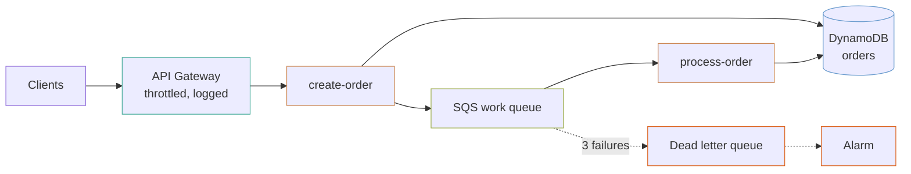

# Serverless orders API

An HTTP API that accepts an order and returns immediately, with the work happening behind a queue. API Gateway, Lambda, DynamoDB and SQS.

## The shape



## Accept fast, process behind a queue

`create-order` writes the order and puts a message on the queue. It does not call the payment provider, the warehouse or the email service. Those happen in `process-order`, which is invoked by the queue.

This is the difference between a p99 of 80 ms and a p99 that tracks whichever downstream service is slowest today. It also means a downstream outage becomes a growing queue rather than a wall of 504s — and the queue drains on its own when the service comes back.

The cost is that the caller gets an order ID before the order is really done, so the API has to expose status and the client has to expect it.

## The cycle, and why the permission is a separate resource

This one bites everybody once:

- The **API** needs each function's `invoke_arn` to build its routes.
- Each **function** needs the API's ARN as the `source_arn` on its invoke permission.

Declare both inside the module blocks and Terraform reports a cycle it cannot break. `aws_lambda_permission` is therefore a standalone resource in `api.tf`, depending on both, with neither depending on it.

**Do not be tempted to drop `source_arn` to make the cycle go away.** Without it, granting `apigateway.amazonaws.com` lets *any* API Gateway in *any* AWS account invoke your function.

## Five things written into this stack

### Visibility timeout is six times the function timeout

`process-order` has a 120-second timeout, so the queue's visibility timeout is 720 seconds. That is what AWS asks for, and the reason is concrete: below it, SQS makes the message visible again while the first invocation is still working on it, and a second invocation picks it up. The order is processed twice, and nothing errors.

### `ReportBatchItemFailures` is on

Without it, one bad message in a batch of ten fails the whole batch, and **all ten are retried** — including the nine that succeeded. With a non-idempotent handler that is nine duplicate side effects per poison message, repeated until the retry count is exhausted.

The handler has to return the failed message IDs for this to work. It is a code change as well as a configuration one.

### The alarm is on queue *age*, not depth

A deep queue that is draining is healthy — that is what a queue is for. A queue whose oldest message keeps getting older is not, however shallow it is.

`ApproximateAgeOfOldestMessage` catches a stuck consumer, a poison message in a loop, and a downstream outage. Depth alarms mostly catch traffic spikes, which is the case you least want to be woken for.

### Dead letters alarm at one, not at a threshold

A message here has already failed three times. Nothing else will retry it, and nothing else will mention it exists. The right threshold is zero.

### The IAM policy names the indexes as well as the table

```hcl
resources = [
  module.orders.arn,
  format("%s/index/*", module.orders.arn),
]
```

A DynamoDB index has its own ARN. A policy naming only the table allows `GetItem` and denies every `Query` against a global secondary index — and the failure appears at runtime, on the one code path that uses the index, long after the deploy looked fine.

## Deploying

Archives live in `lambda_bucket` and are named by version, so a deploy is a variable change:

```bash
terraform apply -var="lambda_bucket=my-artifacts" -var='functions={create-order={s3_key="create-order/v1.1.0.zip",http_path="orders"},process-order={s3_key="process-order/v1.1.0.zip",consumes_queue=true,timeout=120}}'
```

**Terraform will not notice a changed archive at the same key.** Version the key, as above, or pass `source_code_hash`. Overwriting `v1.0.0.zip` and re-applying is a no-op that reports success.

## What it costs

At a million requests a month, this is nearly free — a few dollars for API Gateway, a couple for Lambda, DynamoDB on demand at pennies for that volume. The costs that actually appear:

| What | Why it shows up |
|---|---|
| **CloudWatch Logs** | Usually the largest line on a small serverless stack. Retention here is 365 days; drop it for chatty functions |
| **API Gateway** | $3.50 per million requests, which passes Lambda's cost at moderate volume |
| **DynamoDB on demand** | Fine until it is not. Provisioned with autoscaling is much cheaper at steady high volume |
| **NAT gateway** | **Not here at all**, because nothing runs in a VPC. Putting a function in a VPC to reach a database adds one |

## What this does not do

- **No authentication.** Every route is `NONE`. The `api-gateway-rest` module supports a Cognito authorizer; wiring one means a user pool and a decision about tokens.
- **No request validation.** It belongs in an OpenAPI document, which the module accepts through `openapi_body` and which this example does not use.
- **No idempotency.** SQS is at-least-once delivery, so `process-order` **will** occasionally see a message twice. The handler needs a conditional write or a deduplication table; nothing here provides one.
- **No provisioned concurrency.** Cold starts are real on a low-traffic API. The module supports it and it bills whether used or not.

## What is not verified

**Nothing here has been applied against AWS**, and the functions themselves do not exist — `lambda_bucket` and the archive keys are yours to supply.
