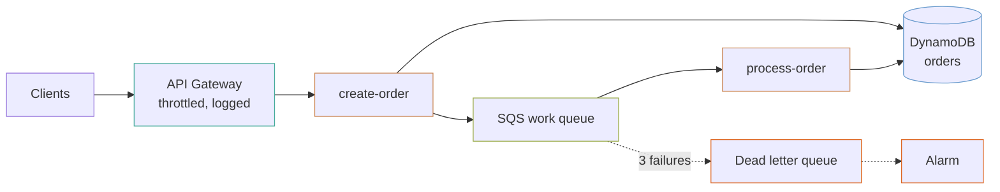

# serverless-api

An orders API that accepts an order and returns immediately, with the work happening behind a queue. API Gateway (REST), Lambda, DynamoDB and SQS.

## What it builds



- A REST API with one route per function that has an `http_path`, throttled and access-logged.
- Two Lambda functions by default, `create-order` (HTTP) and `process-order` (queue consumer), with X-Ray active tracing and a shared IAM role.
- A DynamoDB table with `by_customer` and `by_status` global secondary indexes and a TTL attribute.
- An SQS work queue with a dead letter queue after three failed receives.
- A KMS key encrypting the table, queues, functions, logs and alert topic.
- An SNS alerts topic and CloudWatch alarms on dead letters, queue age, API 5XX errors, DynamoDB throttling and each function's errors.

## Before you deploy

- AWS credentials for the target account, and Terraform 1.9 or later.
- **Deployment archives in S3.** `lambda_bucket` has no default, and the archive keys in `functions` must exist in it. The example does not build or upload function code.
- **The API Gateway CloudWatch role for the account.** Stage access logging needs it, and it is one setting per account and region. In an account where nothing has set it, apply with `-var="manage_api_gateway_account_role=true"`. Where something else already manages it, leave it off so the two do not fight.

## How to use it

```bash
terraform init
terraform plan -var="lambda_bucket=my-artifacts"
terraform apply -var="lambda_bucket=my-artifacts"
```

Archives are named by version, so a code deploy is a variable change:

```bash
terraform apply -var="lambda_bucket=my-artifacts" -var='functions={create-order={s3_key="create-order/v1.1.0.zip",http_path="orders"},process-order={s3_key="process-order/v1.1.0.zip",consumes_queue=true,timeout=120}}'
```

**Terraform does not notice a changed archive at the same key.** Version the key, as above, or pass `source_code_hash`. Overwriting `v1.0.0.zip` and re-applying does nothing and reports success.

To check the example without AWS credentials, run its plan test from the top of the repository. It plans against mock providers and creates nothing:

```bash
make test DIR=examples/serverless-api
```

The `.tf` files call modules by relative path (`../../modules/<name>`). If you copy this example outside this repository, change each `source` to `github.com/kingletas/terraform-aws-modules//modules/<name>?ref=v0.5.0`.

## Inputs worth knowing

| Variable | Default | What it changes |
|---|---|---|
| `lambda_bucket` | none | Bucket holding the deployment archives |
| `functions` | `create-order`, `process-order` | Functions, their archive keys, memory, timeout, HTTP route or queue wiring |
| `lambda_runtime` | `python3.13` | Runtime for every function |
| `stage_name` | `v1` | API stage, which becomes the first path segment |
| `throttling_rate_limit` | `200` | Steady requests per second; burst is twice this |
| `manage_api_gateway_account_role` | `false` | Create and set the account's API Gateway logging role |
| `alert_email` | `null` | Email subscribed to alarms; the subscription must be confirmed from the inbox |

## Accept fast, process behind a queue

`create-order` writes the order and puts a message on the queue. It does not call the payment provider, the warehouse or the email service. Those happen in `process-order`, which the queue invokes.

Response time then stays flat instead of tracking whichever downstream service is slowest today. A downstream outage becomes a growing queue rather than a wall of 504s, and the queue drains when the service comes back.

The cost is that the caller gets an order ID before the order is done, so the API has to expose status and the client has to expect it.

## The cycle, and why the permission is a separate resource

- The **API** needs each function's `invoke_arn` to build its routes.
- Each **function** needs the API's ARN as the `source_arn` on its invoke permission.

Declare both inside the module blocks and Terraform reports a cycle. So `aws_lambda_permission` is a standalone resource in `api.tf` that depends on both, and neither depends on it.

**Do not drop `source_arn` to make the cycle go away.** Without it, granting `apigateway.amazonaws.com` lets *any* API Gateway in *any* AWS account invoke your function.

## Five things written into this stack

### Visibility timeout is six times the function timeout

`process-order` has a 120-second timeout, so the queue's visibility timeout is 720 seconds, as AWS recommends. Below that, SQS makes the message visible again while the first invocation is still working on it, and a second invocation picks it up. The order is processed twice, and nothing errors.

### `ReportBatchItemFailures` is on

Without it, one bad message in a batch of ten fails the whole batch, and **all ten are retried**, including the nine that succeeded. With a handler that is not idempotent, that is nine duplicate side effects per bad message, repeated until the retries run out.

The handler has to return the failed message IDs for this to work. It is a code change as well as a configuration one.

### The alarm is on queue *age*, not depth

A deep queue that is draining is healthy; that is what a queue is for. A queue whose oldest message keeps getting older is not, however shallow it is.

`ApproximateAgeOfOldestMessage` over 300 seconds catches a stuck consumer, a message failing in a loop, and a downstream outage. Depth alarms mostly catch traffic spikes, which is the case you least want to be woken for.

### Dead letters alarm at one, not at a threshold

A message in the dead letter queue has already failed three times. Nothing else will retry it or mention it exists, so the alarm fires on the first one. The same queue receives asynchronous Lambda invocations that exhaust their retries.

### The IAM policy names the indexes as well as the table

```hcl
resources = [
  module.orders.arn,
  format("%s/index/*", module.orders.arn),
]
```

A DynamoDB index has its own ARN. A policy naming only the table allows `GetItem` and denies every `Query` against a global secondary index. The failure appears at runtime, on the one code path that uses the index, long after the deploy looked fine.

## Costs

At a million requests a month this is nearly free: a few dollars for API Gateway, a couple for Lambda, and pennies for DynamoDB on demand. The lines that grow:

| What | Why it shows up |
|---|---|
| **CloudWatch Logs** | Usually the largest line on a small serverless stack. Function log retention is 365 days; lower it for chatty functions |
| **API Gateway** | $3.50 per million requests for a REST API, which overtakes Lambda's cost at moderate volume |
| **DynamoDB on demand** | Fine at low and spiky volume. Provisioned capacity with autoscaling is much cheaper at steady high volume |
| **KMS** | $1 a month for the key, plus request charges |
| **NAT gateway** | None, because nothing runs in a VPC. Putting a function in a VPC to reach a database adds one |

## Limits

- **No authentication.** Every route uses `NONE`. The `api-gateway-rest` module accepts `authorizers` (Cognito or a Lambda authorizer); wiring one means a user pool or authorizer function and a decision about tokens.
- **No request validation.** It belongs in an OpenAPI document, which the module accepts through `openapi_body` and this example does not use.
- **No idempotency.** SQS delivers at least once, so `process-order` **will** occasionally see a message twice. The handler needs a conditional write or a deduplication table; nothing here provides one.
- **No provisioned concurrency.** Cold starts are noticeable on a low-traffic API. The `lambda-function` module supports `provisioned_concurrency`, and it bills whether used or not.
- **No function code.** The archives in `lambda_bucket` are yours to build and upload.
