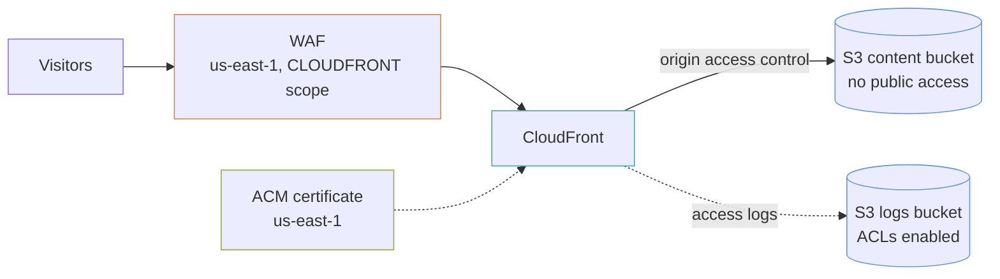

# static-site-cdn

A private S3 bucket that nothing on the internet can reach directly, served through CloudFront with origin access control, a WAF, and a certificate in the region CloudFront requires.

## What it builds



- A versioned content bucket, with old versions expired after 30 days, and a bucket policy that lets only this distribution read it.
- A logs bucket with ACLs enabled, expiring objects after 90 days.
- An ACM certificate in `us-east-1` for the domain and any additional names, validated through DNS.
- A WAF web ACL in `us-east-1` with three AWS managed rule groups and a rate limit (optional).
- A CloudFront distribution using the AWS managed CachingOptimized and CORS-S3Origin policies.
- A Route 53 alias record for each domain.

## Before you deploy

- AWS credentials for the target account, and Terraform 1.9 or later.
- A public Route 53 hosted zone for the domain, in the same account. The example looks it up by `hosted_zone_name` and writes the validation and alias records into it.

## How to use it

`domain_name` and `hosted_zone_name` have no defaults:

```bash
terraform init
terraform plan -var domain_name=www.example.com -var hosted_zone_name=example.com
terraform apply -var domain_name=www.example.com -var hosted_zone_name=example.com
```

To check the example without AWS credentials, run its plan test from the top of the repository. It plans against mock providers and creates nothing:

```bash
make test DIR=examples/static-site-cdn
```

The `.tf` files call modules by relative path (`../../modules/<name>`). If you copy this example outside this repository, change each `source` to `github.com/kingletas/terraform-aws-modules//modules/<name>?ref=v0.3.0`.

### Deploy content

```bash
aws s3 sync ./dist "s3://$(terraform output -raw content_bucket)" --delete
```

Then invalidate, because CloudFront caches. This prints the command:

```bash
terraform output -raw invalidation_command
```

**Invalidate narrowly.** The first 1,000 paths a month are free and each path after that costs $0.005, so `/*` on every deploy adds up. The usual pattern is content-hashed asset filenames such as `app.4f2c1a.js`, which never need invalidating, with `/index.html` as the only path you purge.

## Inputs worth knowing

| Variable | Default | What it changes |
|---|---|---|
| `domain_name` | none | Domain the site answers on |
| `hosted_zone_name` | none | Route 53 zone holding that domain |
| `additional_domains` | `[]` | Extra names, each added to the certificate and given a record |
| `single_page_app` | `true` | Serve `/index.html` with a 200 for 403 and 404 |
| `enable_waf` | `true` | Put the WAF in front |
| `price_class` | `PriceClass_100` | Edge locations used; `PriceClass_100` is North America and Europe |
| `geo_restriction` | `null` | Allow or block countries by two-letter code |
| `region` | `us-east-1` | Region for the buckets; CloudFront itself is global |

## Three things that must live in us-east-1

CloudFront is global, and three of its inputs are read only from `us-east-1` regardless of where the rest of your stack is:

1. **The ACM certificate.** A certificate in `eu-west-1` cannot be attached, and the error does not explain why.
2. **The WAF web ACL**, when its scope is `CLOUDFRONT`.
3. **Lambda@Edge functions**, if you add any.

This example declares an aliased provider, `aws.us_east_1`, and passes it to the certificate and WAF modules. That is why `versions.tf` here declares a second provider.

## Two buckets, because of one setting

The content bucket uses `BucketOwnerEnforced`, which turns S3 ACLs off entirely. That is the right default and it is what the `s3-bucket` module sets.

**CloudFront access logging writes with an ACL.** It cannot deliver to a bucket where ACLs are off. So the logs go to a second bucket with `BucketOwnerPreferred`, and the more permissive setting is confined to a bucket holding nothing but logs.

The failure is silent: the distribution applies cleanly and never writes a log file.

## The read grant the module does not write

`create_origin_access_control = true` creates the signing identity. **It does not grant the distribution permission to read the bucket.** A module that edited another module's bucket policy would be reaching across a boundary, so this example writes the statement and passes it to the bucket's `policy_documents`, which merges it into the one policy a bucket can have:

```hcl
condition {
  test     = "StringEquals"
  variable = "AWS:SourceArn"
  values   = [module.cdn.arn]
}
```

That condition limits the grant to *this* distribution rather than any CloudFront distribution. Without the grant, every request returns 403 and the site looks broken rather than unauthorised.

The statement names the bucket by an ARN built from its name, not from the module's `arn` output. That output waits for the bucket policy, so referencing it would form a cycle.

## Single-page apps and the 404 mapping

A React or Vue app routed on the client has no `/orders/1234` object in the bucket. S3 returns 404, and the visitor sees an error page for a route the app handles.

`single_page_app = true` maps 403 and 404 to `/index.html` with a **200**, so the app boots and its router takes over.

**Turn this off for a site with real content.** Otherwise a genuine missing page returns 200 and search engines index your error page as a real one.

## Costs

For a small site this is one of the cheapest things AWS offers. Figures are approximate list prices per month.

| What | Roughly |
|---|---|
| CloudFront, 100 GB out and 1M requests | `██░░░░░░░░` $10 |
| S3 storage, a few GB | `░░░░░░░░░░` under $1 |
| Route 53 hosted zone | `█░░░░░░░░░` $0.50 |
| **WAF** | `█████░░░░░` **$5 per web ACL + $1 per rule + $0.60 per million requests** |

**The WAF is the largest line on a low-traffic site**, and often costs more than the hosting. This example's web ACL has four rules (three managed rule groups and a rate limit), so about $9 a month before requests. `enable_waf = false` is a reasonable choice for a marketing site with no forms; it is not for anything taking input.

## Limits

- **No cache invalidation on apply.** Terraform does not invalidate; your deploy step does.
- **No response headers policy.** A real site wants HSTS, a content security policy and `X-Content-Type-Options`. The distribution module accepts `response_headers_policy_id` in `default_behaviour`; choosing one depends on your content.
- **No origin failover.** The `cloudfront-distribution` module does not support origin groups, so an S3 regional outage is a site outage.
- **No `www` to apex redirect.** Every name is on the certificate and gets a record, but they all serve the same content. A redirect needs a CloudFront Function.
