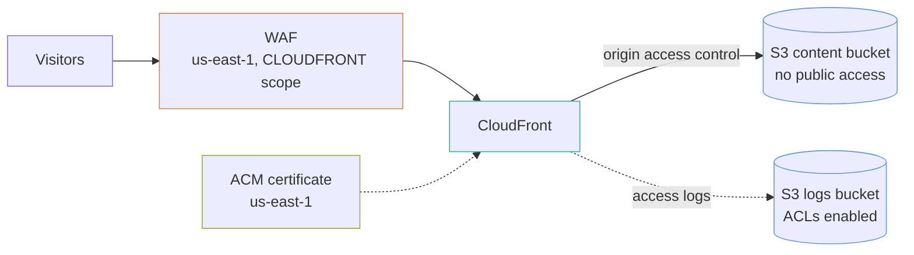

# Static site behind CloudFront

A private S3 bucket that nothing on the internet can reach directly, served through CloudFront with origin access control, a WAF, and a certificate in the region CloudFront insists on.

## The shape



## Three things that must live in us-east-1

CloudFront is global, and three of its inputs are read only from `us-east-1` regardless of where the rest of your stack is:

1. **The ACM certificate.** A certificate in `eu-west-1` simply cannot be attached, and the error does not explain why.
2. **The WAF web ACL**, when its scope is `CLOUDFRONT`.
3. **Lambda@Edge functions**, if you add any.

This example declares an aliased provider for exactly that, and passes it to the two modules that need it. It is the reason `versions.tf` here is longer than in the other examples.

## Two buckets, because of one setting

The content bucket uses `BucketOwnerEnforced`, which turns S3 ACLs off entirely. That is the right default and it is what the `s3-bucket` module sets.

**CloudFront access logging writes with an ACL.** It cannot deliver to a bucket where ACLs are off. So the logs go to a second bucket with `BucketOwnerPreferred`, and the more permissive setting is confined to a bucket holding nothing but logs.

This surprises people because the failure is silent: the distribution applies cleanly and simply never writes a log file.

## The bucket policy the module does not write

`create_origin_access_control = true` makes the signing identity. **It does not grant the distribution permission to read the bucket** — a module that edited another module's bucket policy would be reaching across a boundary, so this example writes it:

```hcl
condition {
  test     = "StringEquals"
  variable = "AWS:SourceArn"
  values   = [module.cdn.arn]
}
```

That condition is what makes it *this* distribution rather than any CloudFront distribution in the world. Without the policy at all, every request returns 403 and the site reads as broken rather than as unauthorised.

## Single-page apps and the 404 mapping

A React or Vue app routed on the client has no `/orders/1234` object in the bucket. S3 returns 404, and the visitor sees an error page for a route the app handles perfectly well.

`single_page_app = true` maps 403 and 404 to `/index.html` with a **200**, so the app boots and its router takes over.

**Turn this off for a site with real content**, or a genuine missing page returns 200 and search engines index your error page as a real one.

## Deploying

```bash
aws s3 sync ./dist "s3://$(terraform output -raw content_bucket)" --delete
```

Then invalidate, because CloudFront caches:

```bash
terraform output -raw invalidation_command
```

**Invalidate narrowly.** The first 1,000 paths a month are free and it is $0.005 per path after that, so `/*` on every deploy is a habit that shows up on the bill. The usual pattern is content-hashed asset filenames — `app.4f2c1a.js` — which never need invalidating at all, with `/index.html` as the only path you ever purge.

## What it costs

For a small site this is one of the cheapest things AWS does.

| What | Roughly |
|---|---|
| CloudFront, 100 GB out and 1M requests | `██░░░░░░░░` $10 |
| S3 storage, a few GB | `░░░░░░░░░░` under $1 |
| Route 53 hosted zone | `█░░░░░░░░░` $0.50 |
| **WAF** | `█████░░░░░` **$6 base + $1 per managed rule group + $0.60/M requests** |

**The WAF is the largest line on a low-traffic site**, and often costs more than the hosting. `enable_waf = false` is a reasonable choice for a marketing site with no forms; it is not for anything taking input.

## What this does not do

- **No cache invalidation on apply.** Terraform does not invalidate; the deploy script does.
- **No response headers policy.** A real site wants HSTS, a content security policy and `X-Content-Type-Options`. The module accepts `response_headers_policy_id`; choosing one is a decision about your own content.
- **No origin failover.** A single origin means an S3 regional outage is an outage. The `cloudfront-distribution` module does not implement origin groups yet — it is the one named gap in the library.
- **No `www` to apex redirect.** Both names can be on the certificate and both get records, but they serve the same content rather than one redirecting to the other. That needs a CloudFront Function.

## What is not verified

**Nothing here has been applied against AWS.** In particular the bucket policy and origin access control pairing is the part most likely to need a second look on first apply.
